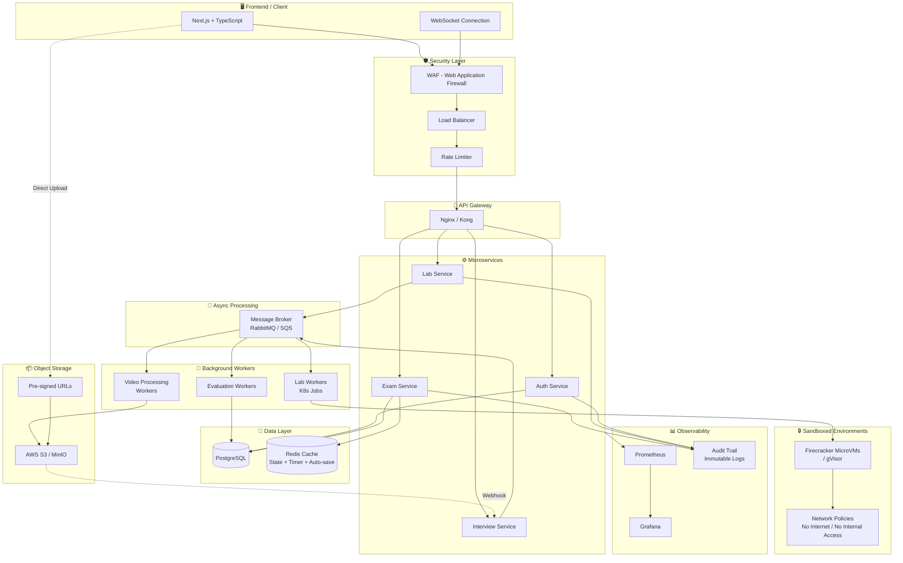
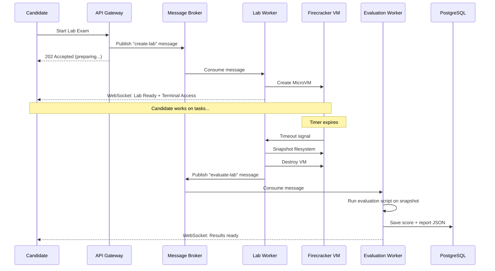
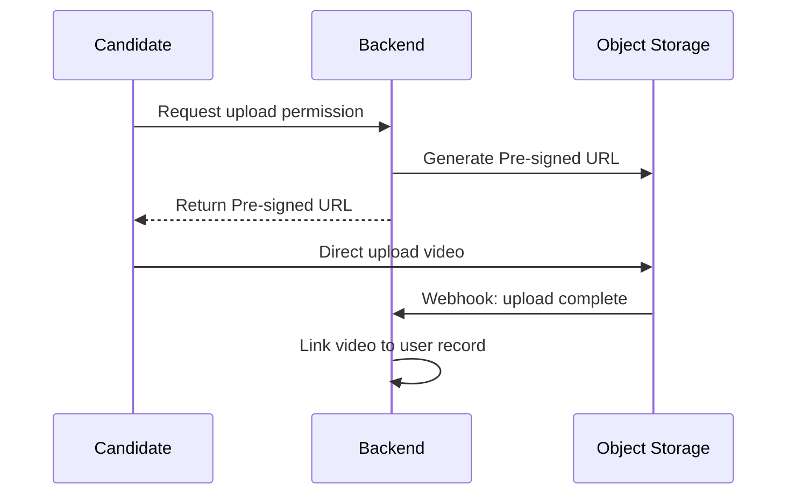
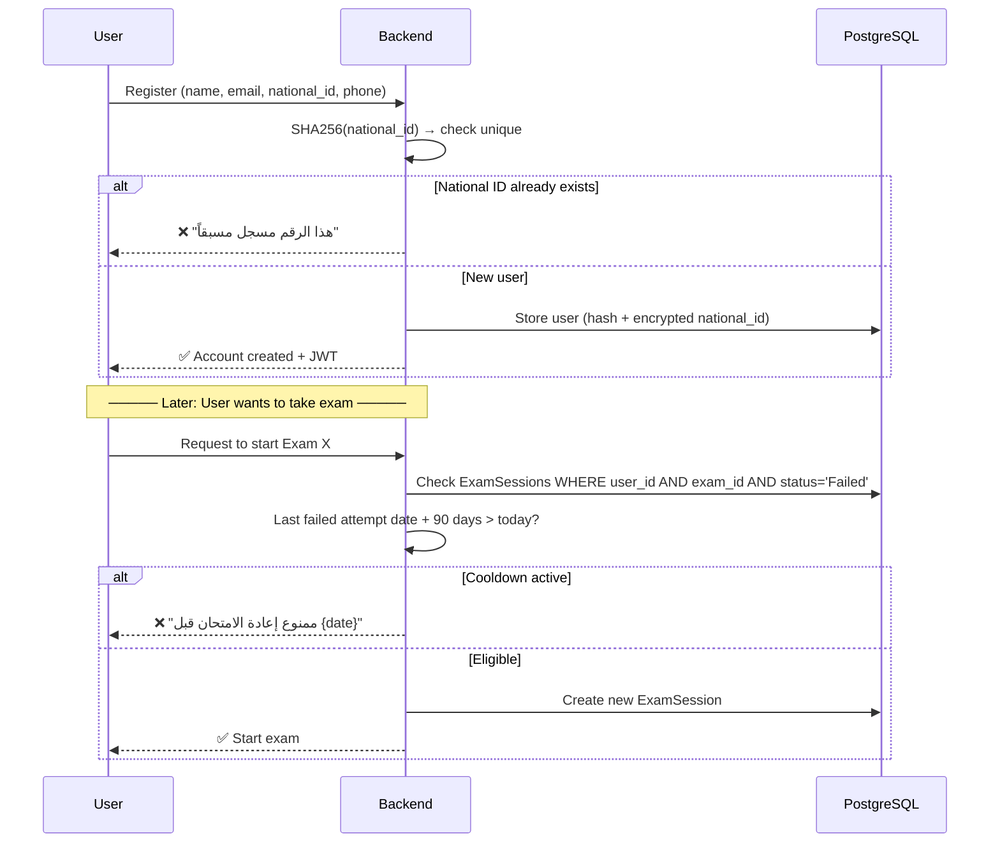
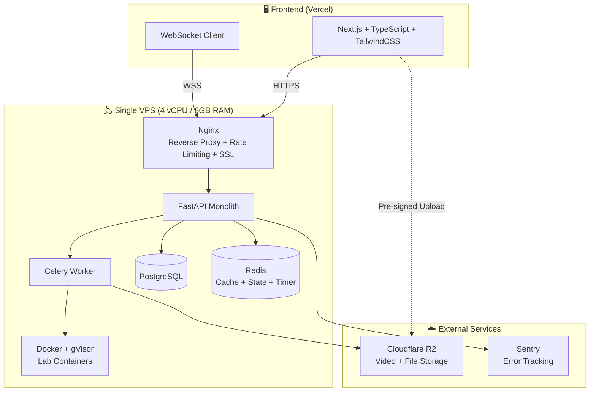
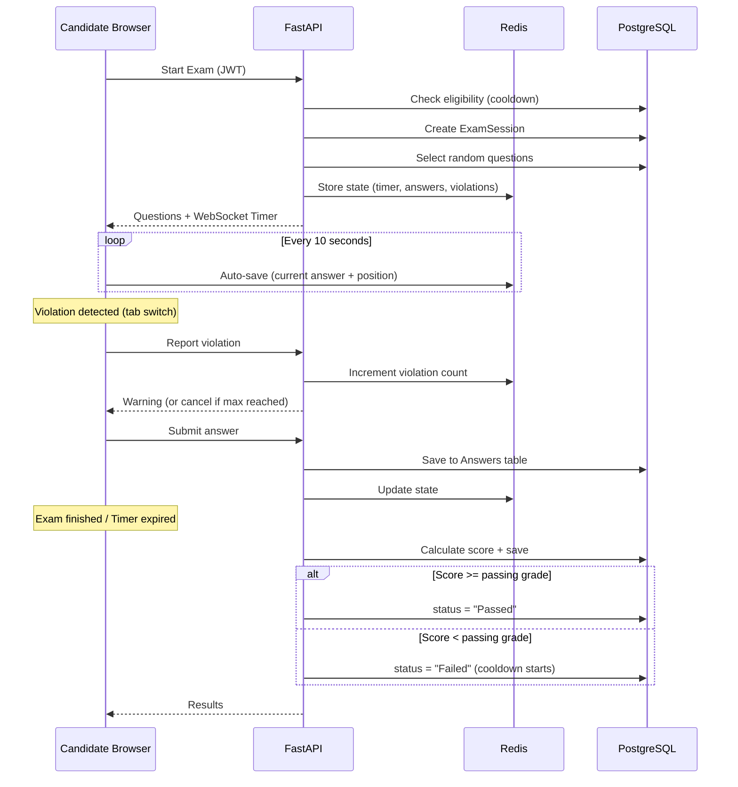
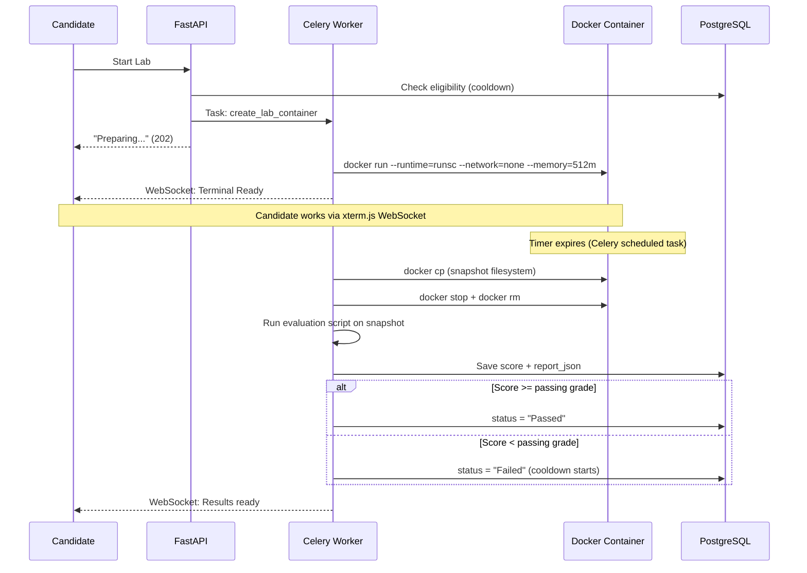
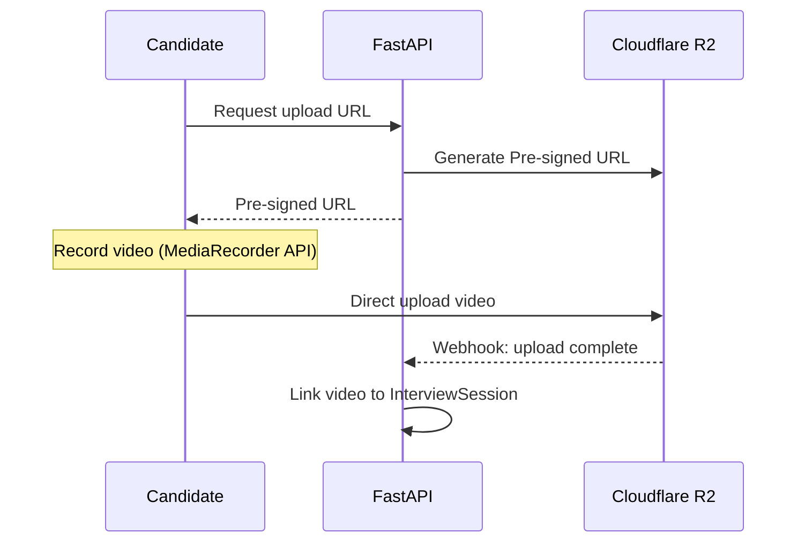
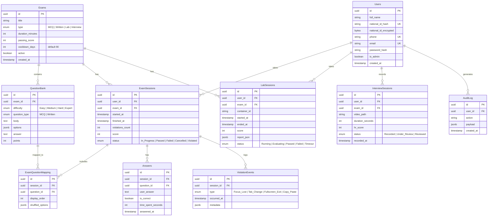

# Technical Assessment Platform - System Design

## Overview
منصة تقييم تقني متكاملة لاختبار المتقدمين للوظائف عبر 3 مراحل أساسية.

---

## High-Level Architecture



---

## Assessment Phases

### Phase 1: MCQ / Written Assessment
- Multiple Choice + Written Questions
- **Server-Side Timer** عبر WebSocket (مش Client-Side عشان محدش يتلاعب)
- Full Screen Mode مع نظام Violations
- منع Copy/Paste و Right Click
- تسجيل كل أحداث الغش (Focus Lost, Tab Change, Fullscreen Exit)
- إلغاء الامتحان بعد عدد معين من المخالفات (configurable)
- **Auto-save** كل 10 ثواني للـ Redis

### Phase 2: Linux Practical Lab
- كل ممتحن يتعمله **Firecracker MicroVM** مستقلة (مش Docker عادي)
- Network Policies صارمة — لا إنترنت، لا وصول للـ Internal Network
- الـ Evaluation Script يشتغل على **Snapshot** من الـ Filesystem
- تقييم تلقائي + تخزين النتيجة كـ JSON

**Workflow:**


### Phase 3: One-Way HR Interview
- أسئلة عشوائية أو ثابتة
- تسجيل فيديو مباشر
- رفع الفيديو عبر **Pre-signed URLs** مباشرة للـ S3
- S3 Webhook يبلغ الـ Backend إن الفيديو جاهز

**Video Upload Flow:**


---

## Database Schema


---

## Key Design Decisions

### 1. Security - Lab Isolation
| Approach | Risk Level | Notes |
|----------|-----------|-------|
| Docker (raw) | ❌ High | Container breakout possible |
| Docker + gVisor | ✅ Medium | Kernel-level sandboxing |
| Firecracker MicroVM | ✅ Low | Full VM isolation, same as AWS Lambda |

### 2. National ID Protection
```
┌─────────────────────────────────────────────┐
│  national_id_hash   = SHA256(national_id)   │  → Unique Constraint (prevent duplicates)
│  national_id_encrypted = AES256(national_id)│  → HR can decrypt when needed
└─────────────────────────────────────────────┘
```

### 3. State Management (Exam Resilience)
```
Frontend → Auto-save every 10s → Redis
                                   ├── Current question index
                                   ├── Answers so far
                                   ├── Remaining time (server-side)
                                   └── Violation count

On reconnect → Read from Redis → Resume exactly where left off
```

### 4. Question Randomization
- أسئلة عشوائية من الـ Question Bank حسب التوزيع:
  - 5 Easy | 10 Medium | 4 Hard | 1 Expert
- Shuffle ترتيب الأسئلة
- Shuffle ترتيب الإجابات (MCQ)
- تتبع أي أسئلة اتعرضت على مين (ExamQuestionMapping)

---

## Tech Stack

| Layer | Technology |
|-------|-----------|
| Frontend | Next.js, TypeScript, TailwindCSS |
| Real-time | WebSocket (Socket.IO) |
| Backend | FastAPI (Python) |
| Database | PostgreSQL |
| Cache | Redis |
| Message Broker | RabbitMQ / AWS SQS |
| Object Storage | AWS S3 / MinIO |
| Lab Isolation | Firecracker / gVisor |
| Orchestration | Kubernetes |
| Gateway | Nginx / Kong |
| Monitoring | Prometheus + Grafana |
| Security | WAF + Rate Limiter |
| Audit | Immutable Append-only Logs |

---

## Scalability Considerations

- **Horizontal Scaling**: كل Service يقدر يتعمله Scale مستقل
- **Message Broker**: يضمن إن الـ System ميقعش تحت الضغط (Spiky Traffic)
- **Pre-signed URLs**: الـ Backend مش بيتحمل bandwidth رفع الفيديوهات
- **Redis**: يقلل الـ Load على PostgreSQL للعمليات المتكررة (Timer, State)
- **K8s Jobs**: كل Lab بيتعمله Job مستقلة بتمسح نفسها بعد ما تخلص

---

## Future Enhancements
- AI Evaluation للـ Linux Lab (تقييم ذكي بدل Scripts ثابتة)
- AI Analysis للـ HR Interview (تحليل لغة الجسد والإجابات)
- توليد امتحانات جديدة تلقائياً من Question Bank
- Dashboard للإحصائيات وتقارير التوظيف
- Ranking System للممتحنين
- Video Storage Retention Policy (نقل لـ Cold Storage بعد 90 يوم)


بدايه في الاول


______________________________________________________________________________________________________________________________________________________________________________________________________________________________________________________

## Technical Assessment Platform - MVP

## Overview
منصة تقييم تقني لاختبار المتقدمين للوظائف عبر 3 مراحل: MCQ/Written، Linux Lab، One-Way Interview.

**Target:** 100 user/day | Single VPS | ~$25-50/mo

---

## Registration & Eligibility Flow

### القواعد:
1. المستخدم **لازم يسجل أولاً** ويدخل الرقم القومي
2. الرقم القومي **لا يتكرر** — شخص واحد = حساب واحد
3. لو فشل في امتحان → **ممنوع يدخله تاني إلا بعد 3 شهور**
4. الـ Cooldown بالامتحان مش بالمنصة (لو فشل في MCQ يقدر يدخل Lab عادي)



### الـ Cooldown Logic (Backend):

```python
from datetime import datetime, timedelta

COOLDOWN_DAYS = 90

async def check_eligibility(user_id: str, exam_id: str, db: Session) -> dict:
    last_failed = db.query(ExamSession).filter(
        ExamSession.user_id == user_id,
        ExamSession.exam_id == exam_id,
        ExamSession.status == "Failed"
    ).order_by(ExamSession.finished_at.desc()).first()

    if last_failed:
        eligible_date = last_failed.finished_at + timedelta(days=COOLDOWN_DAYS)
        if datetime.utcnow() < eligible_date:
            return {
                "eligible": False,
                "retry_after": eligible_date.isoformat(),
                "message": f"ممنوع إعادة الامتحان قبل {eligible_date.strftime('%Y-%m-%d')}"
            }

    return {"eligible": True}
```

---

## Architecture



---

## Assessment Phases

### Phase 1: MCQ / Written Assessment



**Features:**
- Full Screen Mode (Fullscreen API)
- Server-Side Timer عبر WebSocket
- Violation System (focus lost, tab change, fullscreen exit, copy/paste)
- Auto-save كل 10 ثواني للـ Redis
- Random question selection + shuffling
- Auto-grading for MCQ
- لو النت فصل → يرجع من Redis لنفس النقطة

---

### Phase 2: Linux Practical Lab



**Security:**
```
Docker flags:
  --runtime=runsc          # gVisor kernel isolation
  --network=none           # لا إنترنت
  --memory=512m            # Max RAM
  --cpus=1                 # Max CPU
  --pids-limit=100         # Prevent fork bombs
  --read-only              # Root filesystem read-only
  --tmpfs /tmp:size=100m   # Writable tmp only
```

---

### Phase 3: One-Way HR Interview



**Note:** الـ Interview مفيهوش Pass/Fail تلقائي — HR هو اللي بيقيّم يدوي.

---

## Database Schema



---

## Tech Stack

| Layer | Technology | Cost |
|-------|-----------|------|
| Frontend | Next.js + TypeScript + TailwindCSS (Vercel Free) | $0 |
| Backend | FastAPI (Python) | included |
| Task Queue | Celery + Redis as broker | included |
| Database | PostgreSQL 16 | included |
| Cache/State | Redis 7 | included |
| Lab Runtime | Docker + gVisor (runsc) | included |
| Web Terminal | xterm.js + WebSocket | included |
| Storage | Cloudflare R2 (10GB Free) | $0-5/mo |
| Reverse Proxy | Nginx + Let's Encrypt | included |
| Server | Single VPS (4 vCPU, 8GB RAM) | ~$20-40/mo |
| Error Tracking | Sentry Free Tier | $0 |
| Domain | Cloudflare | ~$10/yr |
| **Total** | | **~$25-50/mo** |

---

## Infrastructure (docker-compose.yml)

```yaml
version: "3.8"

services:
  api:
    build: ./backend
    ports:
      - "8000:8000"
    environment:
      - DATABASE_URL=postgresql://user:pass@db:5432/assessments
      - REDIS_URL=redis://redis:6379
      - S3_ENDPOINT=${S3_ENDPOINT}
      - S3_ACCESS_KEY=${S3_ACCESS_KEY}
      - S3_SECRET_KEY=${S3_SECRET_KEY}
      - ENCRYPTION_KEY=${ENCRYPTION_KEY}
      - JWT_SECRET=${JWT_SECRET}
    depends_on:
      - db
      - redis
    volumes:
      - /var/run/docker.sock:/var/run/docker.sock
    restart: unless-stopped

  celery-worker:
    build: ./backend
    command: celery -A app.worker worker --loglevel=info --concurrency=4
    environment:
      - DATABASE_URL=postgresql://user:pass@db:5432/assessments
      - REDIS_URL=redis://redis:6379
    depends_on:
      - db
      - redis
    volumes:
      - /var/run/docker.sock:/var/run/docker.sock
    restart: unless-stopped

  celery-beat:
    build: ./backend
    command: celery -A app.worker beat --loglevel=info
    environment:
      - REDIS_URL=redis://redis:6379
    depends_on:
      - redis
    restart: unless-stopped

  db:
    image: postgres:16-alpine
    volumes:
      - pgdata:/var/lib/postgresql/data
    environment:
      - POSTGRES_DB=assessments
      - POSTGRES_USER=user
      - POSTGRES_PASSWORD=${DB_PASSWORD}
    restart: unless-stopped

  redis:
    image: redis:7-alpine
    command: redis-server --maxmemory 256mb --maxmemory-policy allkeys-lru
    volumes:
      - redisdata:/data
    restart: unless-stopped

  nginx:
    image: nginx:alpine
    ports:
      - "80:80"
      - "443:443"
    volumes:
      - ./nginx/nginx.conf:/etc/nginx/nginx.conf
      - ./nginx/certs:/etc/nginx/certs
    depends_on:
      - api
    restart: unless-stopped

volumes:
  pgdata:
  redisdata:
```

---

## Security (Day 1)

```
✅ HTTPS (Let's Encrypt via Certbot)
✅ JWT with refresh tokens
✅ National ID: SHA256 Hash (unique constraint) + AES-256 encrypted
✅ Rate limiting: 10 req/s per IP (Nginx)
✅ Lab containers: --runtime=runsc (gVisor)
✅ Lab containers: --network=none
✅ Lab containers: --memory=512m --cpus=1 --pids-limit=100
✅ Input validation: Pydantic models
✅ SQL injection: SQLAlchemy ORM
✅ CORS: whitelist frontend domain only
✅ Secrets: .env file (never committed)
✅ Evaluation: runs on snapshot not live container
✅ Cooldown enforcement: server-side (can't bypass from frontend)
```

---

## Key Design Decisions

### National ID Protection
```
Registration:
  national_id → SHA256(national_id) → store as national_id_hash (UNIQUE)
  national_id → AES256(national_id) → store as national_id_encrypted
  
Duplicate check: compare hash (fast, O(1) with index)
HR needs original: decrypt with ENCRYPTION_KEY
```

### Exam Cooldown (3 Months)
```
ExamSessions table:
  status = "Failed" + finished_at = "2026-03-01"
  
User tries again on 2026-04-15:
  eligible_date = 2026-03-01 + 90 days = 2026-05-30
  today (2026-04-15) < eligible_date → ❌ BLOCKED

User tries again on 2026-06-05:
  today (2026-06-05) > eligible_date → ✅ ALLOWED
```

### State Management (Disconnect Resilience)
```
Frontend → Auto-save every 10s → Redis
                                   ├── Current question index
                                   ├── Answers submitted
                                   ├── Remaining time (server-authoritative)
                                   └── Violation count

Internet drops → Reconnect → Read Redis → Resume same point
```

### Question Randomization
- توزيع: 5 Easy | 10 Medium | 4 Hard | 1 Expert
- Shuffle ترتيب الأسئلة
- Shuffle ترتيب الإجابات (MCQ)
- ExamQuestionMapping يتتبع أي أسئلة اتعرضت على مين

---

## Project Structure

```
project/
├── docker-compose.yml
├── .env                         # Secrets (not in git)
├── .env.example
├── nginx/
│   ├── nginx.conf
│   └── certs/
├── backend/
│   ├── Dockerfile
│   ├── requirements.txt
│   ├── alembic/                 # DB migrations
│   │   └── versions/
│   ├── app/
│   │   ├── main.py              # FastAPI app + WebSocket
│   │   ├── config.py            # Settings (from env)
│   │   ├── dependencies.py      # DI (db session, current user)
│   │   ├── models/              # SQLAlchemy models
│   │   │   ├── user.py
│   │   │   ├── exam.py
│   │   │   ├── question.py
│   │   │   └── session.py
│   │   ├── schemas/             # Pydantic schemas
│   │   │   ├── auth.py
│   │   │   ├── exam.py
│   │   │   └── lab.py
│   │   ├── api/                 # Route handlers
│   │   │   ├── auth.py          # Register + Login + National ID check
│   │   │   ├── exams.py         # Start exam + eligibility check
│   │   │   ├── labs.py
│   │   │   ├── interviews.py
│   │   │   └── admin.py
│   │   ├── services/
│   │   │   ├── auth_service.py
│   │   │   ├── eligibility.py   # Cooldown logic
│   │   │   ├── exam_service.py
│   │   │   ├── lab_service.py
│   │   │   └── evaluation.py
│   │   ├── worker.py            # Celery tasks
│   │   └── websocket.py         # Timer + Terminal
│   ├── evaluation_scripts/
│   │   ├── linux_basics.sh
│   │   └── nginx_setup.sh
│   └── tests/
├── frontend/
│   ├── package.json
│   ├── src/
│   │   ├── app/
│   │   │   ├── page.tsx
│   │   │   ├── register/
│   │   │   ├── login/
│   │   │   ├── exam/
│   │   │   ├── lab/
│   │   │   ├── interview/
│   │   │   └── admin/
│   │   ├── components/
│   │   │   ├── ExamScreen.tsx
│   │   │   ├── Terminal.tsx
│   │   │   ├── VideoRecorder.tsx
│   │   │   └── CooldownNotice.tsx
│   │   └── lib/
│   │       ├── api.ts
│   │       ├── websocket.ts
│   │       └── auth.ts
│   └── public/
└── lab-images/
    ├── linux-basics/Dockerfile
    └── nginx-setup/Dockerfile
```

---

## Sprint Plan

### Sprint 1 (Week 1-2): Registration + Auth
- [ ] User Registration (name, email, phone, national_id)
- [ ] National ID: Hash + AES-256 + Unique check
- [ ] Login (JWT + Refresh Token)
- [ ] Eligibility service (cooldown logic)
- [ ] Admin panel لإدارة الأسئلة والامتحانات
- [ ] Question Bank CRUD
- [ ] Docker Compose setup

### Sprint 2 (Week 3-4): MCQ/Written Exam
- [ ] Eligibility check before starting
- [ ] Full Screen Exam Mode
- [ ] Server-side Timer (WebSocket)
- [ ] Violation Detection + System
- [ ] Auto-save to Redis
- [ ] Random question selection + shuffling
- [ ] Auto-grading → Pass/Fail + Cooldown trigger

### Sprint 3 (Week 5-6): Linux Lab
- [ ] Eligibility check before starting
- [ ] Docker + gVisor container creation
- [ ] Web terminal (xterm.js + WebSocket)
- [ ] Timer + auto-destroy (Celery Beat)
- [ ] Filesystem snapshot + evaluation
- [ ] Score → Pass/Fail + Cooldown trigger

### Sprint 4 (Week 7-8): One-Way Interview
- [ ] Video recording UI (MediaRecorder API)
- [ ] Pre-signed URL upload to R2
- [ ] Link video to user session
- [ ] HR review interface (watch + score)

### Sprint 5 (Week 9-10): Polish + Launch
- [ ] Results dashboard + cooldown status display
- [ ] Email notifications (invite, results, cooldown expiry)
- [ ] Basic analytics
- [ ] Security audit
- [ ] Load testing (100 users)
- [ ] Deploy to production

---

## API Endpoints (Key)

```
POST   /api/auth/register          # Register + National ID check
POST   /api/auth/login             # Login → JWT
POST   /api/auth/refresh           # Refresh token

GET    /api/exams                  # List available exams
GET    /api/exams/{id}/eligibility # Check if user can take exam
POST   /api/exams/{id}/start       # Start exam (checks cooldown)
POST   /api/exams/{id}/answer      # Submit answer
POST   /api/exams/{id}/finish      # End exam

POST   /api/labs/{id}/start        # Start lab (checks cooldown)
GET    /api/labs/{id}/status       # Lab status
POST   /api/labs/{id}/stop         # Manual stop

POST   /api/interviews/{id}/upload-url   # Get pre-signed URL
POST   /api/interviews/{id}/complete     # Mark as recorded

GET    /api/admin/users            # List users
GET    /api/admin/results          # All results
GET    /api/admin/results/{user}   # User results + cooldown info
```

---

## Scaling Roadmap

| Signal | Action |
|--------|--------|
| > 500 users/day | أضف Load Balancer + سيرفر ثاني |
| > 50 concurrent labs | انقل Labs لسيرفر مستقل |
| > 2000 users/day | فصّل Microservices |


1. نظرة عامة وغرض المنصة
المنصة منصة تقييم تقني للمتقدمين للوظائف، تتكون من 3 مراحل:

MCQ / أسئلة مقالية (كتابية)

Linux Lab عملي

مقابلة فيديو أحادية الاتجاه (One-Way Interview)

الهدف أن تدعم 100 مستخدم يومياً على خادم VPS واحد بميزانية لا تتجاوز 50 دولاراً شهرياً. التصميم مبدئي (MVP) وقابل للتوسع لاحقاً.

2. عملية التسجيل والتحقق من الأهلية (Registration & Eligibility Flow)
القواعد الأساسية:
المستخدم يجب أن يسجل أولاً برقمه القومي (National ID).

الرقم القومي لا يمكن أن يتكرر، أي أن كل شخص له حساب واحد فقط.

في حال رسوب المستخدم في امتحان معين، يُمنع من إعادته إلا بعد 90 يوماً (فترة تبريد).

التبريد يكون لكل امتحان على حدة، وليس للمنصة بأكملها؛ فلو رسب في MCQ يمكنه دخول Lab فوراً دون انتظار.

آلية التسجيل (التفاصيل الدقيقة):
عندما يرسل المستخدم بيانات التسجيل (الاسم، البريد الإلكتروني، رقم الهاتف، الرقم القومي):

التحقق من فريدة الرقم القومي:

يأخذ النظام الرقم القومي ويطبق عليه دالة SHA256، فينتج قيمة هاش national_id_hash.

يتم البحث في قاعدة البيانات عن هذا الهاش في عمود national_id_hash الذي عليه قيد UNIQUE.

إذا وُجد سجل بنفس الهاش → يعني أن الرقم القومي مسجل مسبقاً → يرجع خطأ "هذا الرقم مسجل مسبقاً".

لماذا نستخدم التجزئة (hashing) بدلاً من تخزين الرقم القومي كما هو؟ لأننا لا نريد تخزين الرقم القومي بصيغة قابلة للقراءة حتى لو تم اختراق قاعدة البيانات. الهاش أحادي الاتجاه (لا يمكن استرجاع النص الأصلي منه)، لكنه يكفي للتحقق من التكرار لأن SHA256("123456789") سينتج نفس الناتج دائماً، ومن المستحيل عملياً وجود تعارض (collision).

ملاحظة أمنية: الدالة SHA256 بدون "salt" هنا مقصودة لأننا نحتاج البحث عن التكرار بدقة. لو أضفنا salt لقيم مختلفة كل مرة، سنفقد خاصية uniqueness، وهذا مقبول لأن الهجوم الوحيد الممكن هو rainbow tables على أرقام قومية محدودة المدى، لكن سنعوض هذا بتشفير النسخة الأصلية (لاحقاً).

تخزين الرقم القومي المشفر للرجوع إليه لاحقاً (لأغراض إدارية):

نأخذ الرقم القومي الأصلي ونشفره باستخدام AES-256 بمفتاح سري (ENCRYPTION_KEY)، لنحصل على national_id_encrypted من نوع bytea (بيانات ثنائية).

هذا يسمح لمسؤولي الموارد البشرية باسترجاع الرقم القومي الحقيقي إذا دعت الحاجة (مثلاً للتوثيق أو التواصل مع الجهات الرسمية) من خلال فك التشفير.

لماذا لا نعتمد فقط على الهاش؟ لأن الهاش لا يمكن عكسه، وفقدان الرقم القومي الأصلي قد يكون مشكلة قانونية أو عملية. التشفير بالمقابل يحفظ البيانات مع إمكانية استعادتها عند الحاجة مع الحفاظ على السرية.

حماية المفتاح السري:

المفتاح ENCRYPTION_KEY يخزن في ملف .env ولا يُرفع أبداً إلى Git، ويحقن في التطبيق عبر متغيرات البيئة.

من المهم استخدام مفتاح عشوائي بطول 256 بت وتخزينه بشكل آمن (مثلاً باستخدام vault لاحقاً).

إنشاء الحساب:

تُملأ باقي الحقول: full_name, email (unique), phone (unique), password_hash (مشتقة من كلمة مرور المستخدم باستخدام خوارزمية مثل bcrypt).

يُنشأ سجل في جدول Users مع id من نوع UUID.

يُعاد للمستخدم رمز JWT يحتوي على user_id وصلاحياته.

آلية التحقق من الأهلية (Cooldown Logic):
عندما يطلب المستخدم بدء امتحان معين (MCQ أو Lab):

يتحقق الخادم من وجود جلسة سابقة لهذا المستخدم (user_id) وهذا الامتحان (exam_id) بحالة Failed، مرتبة تنازلياً حسب تاريخ الانتهاء.

إذا وُجدت جلسة فاشلة، يحسب: eligible_date = finished_at + 90 days.

ملاحظة دقيقة: التواريخ كلها تُخزن بنظام UTC لتجنب مشاكل التوقيت الصيفي والمناطق الزمنية. عند عرض التاريخ للمستخدم يُحوّل إلى توقيته المحلي.

إذا كان التوقيت الحالي (UTC) أقل من eligible_date → المستخدم غير مؤهل، يُرجع eligible: false مع رسالة تحدد التاريخ المسموح فيه الإعادة.

إذا لم توجد جلسة فاشلة، أو تجاوز التاريخ المسموح → يُنشئ جلسة جديدة ExamSession بحالة In_Progress.

معالجة سباق البيانات (Race Condition): لو حاول المستخدم الضغط على زر "بدء الامتحان" مرتين بسرعة، قد لا يكون هناك جلسة مكتملة بعد، لذا العملية كلها تتم داخل معاملة قاعدة بيانات (database transaction) أو نستخدم قفل تشاؤمي (select for update) على صف المستخدم لضمان عدم تكرار الجلسات.

مثال عملي:
رسب المستخدم في 1 مارس 2026.

يحاول الدخول مجدداً في 15 أبريل 2026: eligible_date = 1 مارس + 90 يوم = 30 مايو. بما أن 15 أبريل < 30 مايو → يمنع.

يحاول في 5 يونيو 2026: 5 يونيو > 30 مايو → يسمح.

3. شرح معماري (Architecture) مُفصَّل
النظام مقسم إلى ثلاث بيئات:

الواجهة الأمامية (Frontend): تستضيفها Vercel (مجاناً)، مبنية بـ Next.js + TypeScript + TailwindCSS.

خادم VPS واحد يحتوي على جميع خدمات الخلفية.

خدمات خارجية: Cloudflare R2 للتخزين + Sentry لتتبع الأخطاء.

مكونات الخادم الداخلية (كلها على VPS واحد):
Nginx:

عكس وكيل (Reverse Proxy) يستقبل طلبات HTTPS ويوجهها إلى FastAPI.

يطبق تحديد المعدل (Rate Limiting) بـ 10 طلبات/ثانية لكل IP لمنع هجمات الحرمان من الخدمة.

يوفر شهادة SSL عبر Let's Encrypt (تجديد تلقائي).

FastAPI (Monolith):

تطبيق واحد يحتوي على كل الـ endpoints (REST و WebSocket).

يتعامل مع قاعدة البيانات مباشرة، ومع Redis، ويُرسل المهام الطويلة إلى Celery.

Celery Worker:

عملية منفصلة تعالج المهام غير المتزامنة، وأهمها: إنشاء حاويات مختبر Linux وتدميرها، تشغيل سكربتات التقييم.

السبب: عملية إنشاء الحاوية وتقييمها قد تستغرق وقتاً، لا نريد حظر خادم API.

Celery Beat:

مجدول دوري (scheduler) يستخدم لجدولة مهام تلقائية، مثلاً إنهاء امتحان انتهى وقته أو تدمير حاوية مختبر بعد انتهاء المهلة.

PostgreSQL 16:

قاعدة البيانات الأساسية، تخزين كل البيانات الدائمة (مستخدمين، امتحانات، جلسات، إجابات...).

اختيار PostgreSQL لأنها تدعم أنواع بيانات متقدمة مثل UUID, JSONB (لتخزين الخيارات وتقارير المختبر)، والمعاملات القوية.

Redis 7:

يُستخدم كـ ذاكرة تخزين مؤقت (Cache) ومخزن حالة (State Store). مثلاً: تخزين إجابات الامتحان الحالي، عداد الوقت، عدد المخالفات. أيضاً يعمل كـ وسيط رسائل (Broker) لـ Celery.

إعداد maxmemory 256mb مع سياسة allkeys-lru يعني أنه عند امتلاء الذاكرة، تُحذف المفاتيح الأقل استخداماً تلقائياً.

Docker + gVisor:

Docker هو محرك الحاويات، و gVisor (من خلال runsc) يوفر طبقة عزل إضافية (kernel userspace) تمنع الحاوية من تنفيذ استدعاءات نظام خطيرة مباشرة على نواة المضيف.

الخدمات الخارجية:
Cloudflare R2:

تخزين كائنات (Object Storage) متوافق مع S3، يُستخدم لحفظ فيديوهات المقابلات.

التحميل يتم مباشرة من المتصفح إلى R2 عبر رابط موقع مُسبقاً (pre-signed URL)، مما يخفف الحمل عن الخادم ويحافظ على الخصوصية (لا تمر البيانات عبر تطبيقنا).

يوجد حد مجاني 10 جيجابايت، والزيادة بتكلفة قليلة.

Sentry:

منصة لتتبع الأخطاء والمراقبة، تُدمج مع FastAPI. في حال حدوث أي استثناء غير معالج، يُرسل تقرير تلقائي إلى Sentry مع تفاصيل الخطأ و stack trace. هذا مهم جداً للإصلاح السريع في بيئة الإنتاج.

الخطة المجانية تكفي لـ 100 مستخدم يومياً.

تدفق الطلب (Request Flow):
يصل طلب HTTPS من متصفح المستخدم إلى Nginx على المنفذ 443.

Nginx يفك تشفير SSL ويتحقق من rate limit ثم يمرر الطلب إلى FastAPI على المنفذ 8000 (داخلياً).

FastAPI يعالج الطلب: يتحقق من JWT، يتواصل مع PostgreSQL أو Redis، وإذا لزم الأمر يرسل مهمة إلى Celery عبر Redis broker.

بالنسبة للـ WebSocket (للمؤقت أو التيرمينال): يُنشئ اتصال دائم عبر Nginx (الذي يدعم WebSocket عبر ترقية البروتوكول) إلى FastAPI، ليتم تبادل البيانات بشكل فوري.

4. المرحلة الأولى: MCQ / أسئلة مقالية (تفاصيل شاملة)
بدء الامتحان:
يرسل المستخدم طلب POST /exams/{id}/start.

الخادم ينفذ فحص الأهلية (cooldown) كما شرحنا.

يُنشأ سجل في ExamSessions بحالة In_Progress.

اختيار الأسئلة (Randomization):

يتم تحديد عدد الأسئلة المطلوبة من كل مستوى صعوبة (مثال: 5 سهل، 10 متوسط، 4 صعب، 1 خبير).

من جدول QuestionBank الخاص بهذا الامتحان، تُختار أسئلة عشوائياً لكل مستوى.

لكل جلسة، يُنشأ سجل في ExamQuestionMapping يربط الجلسة بالأسئلة المختارة مع ترتيب عرضها، ويُخزن أيضاً الخيارات بعد خلطها (لكل سؤال MCQ) في حقل shuffled_options من نوع JSONB.

لماذا نخزن خيارات مخلوطة خاصة بالجلسة؟ حتى لا يغش المستخدمون عبر حفظ ترتيب الإجابات، فالخلط يختلف من جلسة لأخرى.

تُعاد الأسئلة مع خياراتها المخلوطة إلى الواجهة الأمامية.

مؤقت الامتحان (Server-Side Timer):
ليس مجرد عداد في المتصفح، بل عداد حقيقي على الخادم لمنع التلاعب بالوقت (مثلاً تغيير ساعة الجهاز).

عند بدء الامتحان، يُخزَّن وقت الانتهاء المتوقع في Redis (مثل exam:{session_id}:deadline بقيمة UTC timestamp)، أو يُحسب الوقت المتبقي بناءً على started_at والمدة الإجمالية.

عبر اتصال WebSocket (أو طلب REST دوري)، يُرسل الخادم الوقت المتبقي للمتصفح. المتصفح يعرضه فقط، لكن القرار بانتهاء الوقت بيد الخادم.

عند انتهاء الوقت (سواء علم العميل أم لا)، يُجبر الخادم على إنهاء الامتحان ويحفظ كل الإجابات غير المحفوظة (من Redis إن وُجدت).

الحفظ التلقائي (Auto-save) في Redis:
كل 10 ثوانٍ، ترسل الواجهة الأمامية إجابات المستخدم الحالية وموقع السؤال الذي يقف عنده إلى الخادم.

الخادم يخزن في Redis هيكل بيانات مثل:

text
Key: session:{session_id}:state
Value (Hash):
  current_question_index: 5
  answers: {"q1": "B", "q3": "Long text answer..."}
  violations_count: 2
  last_active: timestamp
ماذا لو انقطع الإنترنت وعاد؟

عند إعادة الاتصال، يطلب العميل حالة الجلسة من الخادم. الخادم يقرأ Redis ويعيد الفهرس والإجابات السابقة، ويستأنف العميل من حيث توقف.

يحمي هذا المستخدم من فقدان إجاباته في حال تعطل الشبكة المؤقت.

نظام المخالفات (Violation System):
الهدف منع الغش الإلكتروني عبر مراقبة سلوك المتصفح:

أنواع المخالفات:

Focus_Lost: عند فقدان التركيز من نافذة الامتحان (تبديل تبويب، فتح تطبيق آخر).

Tab_Change: تغيير التبويب.

Fullscreen_Exit: الخروج من وضع ملء الشاشة.

Copy_Paste: محاولة نسخ أو لصق (نمنعها أيضاً عبر أحداث المتصفح).

عندما يكتشف المتصفح مخالفة، يرسل إشعاراً إلى الخادم عبر WebSocket أو REST.

الخادم يزيد عداد المخالفات في Redis، وإذا تجاوز حداً معيناً (مثلاً 3 مخالفات)، يمكن أن يلغي الامتحان تلقائياً (يغير الحالة إلى Violated أو Cancelled).

تسجل كل مخالفة في جدول ViolationEvents مع الطابع الزمني وبيانات وصفية (مثلاً نوع المتصفح).

تقديم الإجابة:
يرسل المستخدم إجابة سؤال معين (حتى لو عاد لسؤال سابق). يُحفظ السجل في جدول Answers:

user_answer: النص المدخل.

is_correct: يُحسب تلقائياً للـ MCQ بمقارنة الإجابة بالإجابة الصحيحة (قد يكون هذا الحساب مؤجل لنهاية الامتحان لتفادي أي خرق). يُفضل تأجيل التصحيح التلقائي إلى نهاية الجلسة لأسباب أمنية (لا نرسل إجابة صحيحة للعميل أبداً).

time_spent_seconds: مدة بقاء المستخدم على هذا السؤال (يُحسب فارق التوقيت بين التحميل والإرسال).

بالنسبة للأسئلة المقالية (Written)، لا يتم التصحيح التلقائي، بل تُعرض لمسؤول HR لاحقاً.

إنهاء الامتحان:
عندما ينتهي الوقت، أو يضغط المستخدم "إنهاء"، يرسل الخادم إشارة لإنهاء الجلسة.

تُجمع كل الإجابات من جدول Answers وتُحسب الدرجة.

إذا كانت الدرجة ≥ درجة النجاح (passing_score)، تُحدَّث حالة الجلسة إلى Passed. وإلا إلى Failed.

في حالة الرسوب، يُسجَّل تاريخ الانتهاء (finished_at)، الذي سيُستخدم لاحقاً لحساب التبريد.

ملاحظة حول Fullscreen API:
نستخدم Fullscreen API لإجبار المتصفح على وضع ملء الشاشة، مما يقلل فرص استخدام تطبيقات أخرى. عند الخروج من هذا الوضع يُعتبر مخالفة.

5. المرحلة الثانية: Linux Practical Lab (تفاصيل شاملة)
تدفق إنشاء البيئة المعزولة:
يطلب المستخدم بدء مختبر معين. يتحقق الخادم من الأهلية (cooldown).

بدلاً من انتظار طويل، يعطي الخادم رداً فورياً 202 Accepted برسالة "Preparing..."، ثم يُرسل مهمة إلى Celery لإنشاء الحاوية.

الـ Celery Worker يقوم بالخطوات التالية:

تنفيذ أمر docker run بصورة معدّة مسبقاً (مثلاً lab-images/linux-basics) مع مجموعة أعلام الأمان الصارمة:

--runtime=runsc: يستخدم gVisor الذي يعزل استدعاءات النظام في وضع مستخدم (user-space kernel) بدلاً من السماح للحاوية باستخدام نواة المضيف مباشرة. هذا يمنع هروبات الحاويات.

--network=none: الحاوية بدون أي اتصال شبكي، فلا يمكن للمستخدم تحميل أدوات أو إرسال بيانات للخارج.

--memory=512m, --cpus=1, --pids-limit=100: حدود صارمة تمنع استهلاك موارد الخادم أو هجمات fork bomb.

--read-only: نظام الملفات الجذر للقراءة فقط، مع --tmpfs /tmp:size=100m لإتاحة مساحة مؤقتة للكتابة (ضرورية لعمل بعض الأوامر).

بمجرد تشغيل الحاوية، يحصل العامل على container_id.

يُحدّث سجل LabSessions بربط container_id وتعيين الحالة إلى Running.

يُرسل العامل رسالة عبر WebSocket إلى المستخدم بأن التيرمينال جاهز.

Web Terminal (xterm.js + WebSocket):
تُفتح قناة WebSocket بين المتصفح والخادم. الخادم (Celery worker أو عملية منفصلة) يقوم بإرفاق (attach) بجلسة الحاوية باستخدام مكتبة مثل dockerpty أو docker SDK لقراءة المُخرجات وكتابة المُدخلات.

أي كتابة من المستخدم في واجهة xterm.js تُرسل إلى الخادم الذي يكتبها إلى stdin الحاوية. والناتج من stdout/stderr يُعاد إلى المتصفح.

لا حاجة لـ SSH، الاتصال آمن عبر WebSocket المشفر بـ TLS.

إدارة الوقت والتدمير التلقائي:
عند بدء الجلسة، يُجدول Celery Beat أو مهمة مؤجلة (باستخدام apply_async(countdown=...)) لإنهاء المختبر تلقائياً بعد انتهاء المدة المحددة (مثلاً 60 دقيقة).

عند استلام مهمة الإنهاء، يقوم العامل:

بعمل docker cp لنسخ نظام الملفات من الحاوية إلى مجلد مؤقت (snapshot).
إيقاف الحاوية (docker stop) ثم حذفها (docker rm).
تشغيل سكريبت تقييم (موجود في evaluation_scripts/) على النسخة الملتقطة. السكريبت يفحص مثلاً وجود ملف معين، صلاحيات، محتوى، أوامر منفذة (إن أمكن تخزينها). يُنتج تقرير JSON بالنتيجة.
يحسب الدرجة ويُخزّنها في LabSessions.score و report_json.
يُحدّث الحالة إلى Passed أو Failed حسب الدرجة مقابل درجة النجاح. وهذا يُطلق آلية التبريد (cooldown) تماماً مثل MCQ.
ملاحظة أمنية مهمة: التقييم لا يحدث على الحاوية الحية أبداً، بل على نسخة محلية، تفادياً لأي تلاعب أثناء التقييم.

التعامل مع الأعطال:
إذا ماتت الحاوية أو خرجت بشكل غير متوقع، تكتشف آلية المراقبة (heartbeat) ذلك وتُنشئ مهمة تقييم طارئة بالاعتماد على آخر لقطة محفوظة إن وُجدت، وإلا تُعتبر Failed.

6. المرحلة الثالثة: مقابلة الفيديو (One-Way Interview)
هذه المرحلة بسيطة نسبياً ولا تتضمن تصحيحاً تلقائياً:

طلب رابط التحميل: يرسل العميل طلباً للحصول على رابط موقع مُسبقاً (pre-signed URL) من R2.

الخادم يولّد رابطاً صالحاً لمدة محدودة (مثلاً 30 دقيقة) باستخدام مفاتيح R2، ويعيده للعميل.

التسجيل: المتصفح يستخدم MediaRecorder API لتسجيل فيديو مباشر من الكاميرا والميكروفون. بعد الانتهاء، يُحمّل المقطع مباشرة إلى R2 باستخدام الرابط السابق. هذا يمنع مرور الملف عبر خادمنا (توفير نطاق ترددي وحماية للخصوصية).

إشعار إتمام الرفع: بعد نجاح الرفع، إما أن يستدعي العميل واجهة POST /interviews/{id}/complete، أو يُهيئ Webhook من R2 ليُعلم الخادم تلقائياً.

تخزين البيانات: يُنشأ سجل في InterviewSessions يحتوي على video_path (مفتاح الكائن في R2)، و duration_seconds، و recorded_at. الحالة تبدأ Recorded.

تقييم HR: يوجد لوحة تحكم للموارد البشرية لمشاهدة الفيديو (باستخدام رابط مؤقت أيضاً) ووضع درجة يدوية (hr_score) وتغيير الحالة إلى Reviewed.

7. مخطط قاعدة البيانات (Database Schema) بتفصيل الجداول
جدول Users
id UUID PK: مفتاح أساسي باستخدام UUIDv4، أفضل من auto-increment لأنه لا يكشف عدد المستخدمين ولا يمكن تخمينه.

full_name VARCHAR: الاسم الكامل.

national_id_hash VARCHAR UNIQUE: هاش SHA256 للرقم القومي، يُستخدم للتحقق من التكرار.

national_id_encrypted BYTEA: النسخة المشفرة بـ AES-256 للرجوع للرقم الحقيقي.

phone VARCHAR UNIQUE, email VARCHAR UNIQUE: معلومات الاتصال.

password_hash VARCHAR: كلمة المرور بعد تشفيرها بـ bcrypt.

is_admin BOOLEAN: لتحديد صلاحيات المدير.

created_at TIMESTAMP: وقت إنشاء الحساب.

فهارس (Indexes): على national_id_hash (فريد)، email، phone لتسريع البحث.

جدول Exams
id UUID PK

title VARCHAR: اسم الامتحان.

type ENUM ('MCQ','Written','Lab','Interview'): نوع الامتحان.

duration_minutes INTEGER: المدة بالدقائق.

passing_score INTEGER: درجة النجاح.

cooldown_days INTEGER DEFAULT 90: فترة التبريد بالأيام (قابلة للتخصيص لكل امتحان).

active BOOLEAN: لإخفاء/إظهار الامتحان.

created_at TIMESTAMP.

جدول QuestionBank
id UUID PK

exam_id UUID FK: العلاقة بالامتحان.

difficulty ENUM ('Easy','Medium','Hard','Expert').

question_type ENUM ('MCQ','Written').

body TEXT: نص السؤال.

options JSONB: خيارات الإجابة (لـ MCQ) بتنسيق {"A": "اختيار1", "B": "اختيار2", ...}.

answer TEXT: الإجابة الصحيحة (نص أو مفتاح الخيار).

points INTEGER: النقاط المخصصة للسؤال.

يتيح JSONB إمكانية إضافة خيارات متعددة بسهولة دون أعمدة إضافية.

جدول ExamSessions
id UUID PK

user_id, exam_id FK: تحدد الجلسة.

started_at, finished_at TIMESTAMP: بداية ونهاية الجلسة.

violations_count INTEGER: عدد المخالفات المسجلة.

score INTEGER: الدرجة النهائية بعد التصحيح.

status ENUM ('In_Progress','Passed','Failed','Cancelled','Violated').

يُستخدم هذا الجدول لحساب التبريد: نبحث عن آخر صف بحالة Failed للمستخدم/الامتحان.

جدول ExamQuestionMapping
يربط جلسة الامتحان بالأسئلة المختارة لها.

session_id FK, question_id FK.

display_order INTEGER: ترتيب عرض السؤال.

shuffled_options JSONB: قائمة الخيارات بعد خلطها (قد يكون مختلفاً عن النموذج الأصلي). مهم جداً لمنع الغش.

نضمن أن كل جلسة لها نسختها المخلوطة.

جدول Answers
id UUID PK

session_id FK, question_id FK.

user_answer TEXT: الإجابة كما أدخلها المستخدم.

is_correct BOOLEAN: يُحدد بواسطة المصحح الآلي (إن أمكن).

time_spent_seconds INTEGER: مدة البقاء على السؤال.

answered_at TIMESTAMP.

جدول ViolationEvents
يسجل كل حدث مخالفة لمزيد من التدقيق.

session_id FK.

type ENUM ('Focus_Lost','Tab_Change','Fullscreen_Exit','Copy_Paste').

occurred_at TIMESTAMP.

metadata JSONB: مثلاً {"browser": "Chrome 120", "reason": "Tab switch"}.

جدول LabSessions
id UUID PK

user_id FK, exam_id FK.

container_id VARCHAR: معرف حاوية دوكر.

started_at, ended_at TIMESTAMP.

score INTEGER.

report_json JSONB: تقرير مفصل من سكريبت التقييم (مثلاً نتائج كل فحص).

status ENUM ('Running','Evaluating','Passed','Failed','Timeout').

جدول InterviewSessions
id UUID PK

user_id FK, exam_id FK.

video_path VARCHAR: مسار الكائن في R2.

duration_seconds INTEGER.

hr_score INTEGER NULL: درجة التقييم البشري.

status ENUM ('Recorded','Under_Review','Reviewed').

recorded_at TIMESTAMP.

جدول AuditLog
لتتبع الإجراءات الهامة (تسجيل الدخول، بدء امتحان، تغيير صلاحيات...) لأغراض الأمان والمراجعة.

id UUID PK, user_id FK (nullable), action VARCHAR, payload JSONB, created_at.

العلاقات موضحة في مخطط ER. الميزة الأساسية: الفصل بين الجلسات المختلفة (MCQ, Lab, Interview) في جداول مستقلة لأن لكل منها خصائص فريدة، لكنها تشترك في مفهوم الأهلية من خلال ExamSessions للـ MCQ/Written و LabSessions للـ Lab.

8. المكدس التقني (Tech Stack) ولماذا هذه الاختيارات؟
Frontend (Next.js + TypeScript + TailwindCSS) على Vercel: اختيار ممتاز لسرعة التطوير وتجربة المستخدم. Vercel تقدم خطة مجانية تدعم النشر التلقائي من Git وتدعم Edge. استخدام TypeScript يضمن سلامة الأنواع ويقلل الأخطاء. TailwindCSS لتصميم سريع واستجابة بدون كتابة CSS مخصص كثير.

Backend (FastAPI): إطار Python حديث غير متزامن (async)، سريع جداً ومناسب لـ WebSocket وREST. يدعم التوثيق التلقائي (OpenAPI). بالنسبة لـ MVP حيث الموارد محدودة، Monolith بـ FastAPI كافٍ ويتجنب تعقيد microservices.

Celery + Redis (Broker): ضروري للمهام الطويلة مثل إنشاء الحاويات. Redis كوسيط يفي بالغرض، ولكن يمكن استبداله لاحقاً بـ RabbitMQ إذا زاد الضغط.

PostgreSQL: قواعد بيانات علائقية قوية، تدعم الـ JSONB مما يعطينا مرونة NoSQL مع ضمانات ACID. أفضل من MySQL في التعامل مع أنواع البيانات المتقدمة.

Redis 7 (حالة/تخزين مؤقت): الأداء فائق السرعة، مثالي لحفظ حالة الامتحان المؤقتة، ويستخدم أيضاً لـ Celery. استهلاك الذاكرة محدود بـ 256 ميجا.

Docker + gVisor (runsc): يوفر عزل قوي بتكلفة أقل من الأجهزة الافتراضية الكاملة. gVisor يضيف طبقة حماية ضد هجمات kernel.

Cloudflare R2: تخزين رخيص جداً (أرخص من S3) ولا توجد رسوم على نقل البيانات للخارج (egress)، مثالي لمقاطع الفيديو.

Sentry: مجاني، ويمنح رؤية فورية للأخطاء في الإنتاج.

Nginx: خفيف وسريع، يدعم عكس الوكيل وWebSocket بسهولة، وإعدادات SSL بسيطة.

9. البنية التحتية (docker-compose.yml) شرح تفصيلي
ملف docker-compose.yml يُعرف جميع الخدمات المطلوبة:

api: صورة مبنية من ./backend. يفتح المنفذ 8000. يمرر متغيرات البيئة الحساسة من .env (مثل ENCRYPTION_KEY, JWT_SECRET). يشارك مقبس Docker (/var/run/docker.sock) ليتمكن من إدارة الحاويات. هذا ضروري لأن Celery worker قد يكون في نفس الخدمة أو منفصل، ولكن الـ API قد يحتاج أيضاً للتحقق من حالة الحاويات. في حالتنا الـ API لا يدير الحاويات مباشرة بل Celery، لذلك يمكن إزالة مشاركة المقبس من api وجعلها فقط في celery-worker. لكن الوثيقة تضعهما معاً، لنفترض أن api قد يستخدمه لإحصائيات بسيطة.

celery-worker: نفس صورة api لكن نقطة البدء هي أمر celery worker. يشارك أيضاً مقبس دوكر. يفصل العمل عن الـ api ليتمكن من التوسع لاحقاً. حددنا --concurrency=4 مما يعني 4 عمليات عاملة متوازية (كافٍ لـ 100 مستخدم).

celery-beat: للتذكير، يقوم بجدولة المهام الدورية مثل تنظيف الجلسات منتهية الصلاحية أو إنهاء الامتحانات تلقائياً.

db: PostgreSQL 16 على صورة Alpine خفيفة. البيانات تُخزن في volume pgdata لتبقى محفوظة بعد إعادة التشغيل.

redis: Redis 7 مع حد أقصى للذاكرة 256MB وسياسة allkeys-lru.

nginx: يستخدم صورة nginx:alpine، يفتح المنفذين 80 و 443. يُحمّل مجلد الشهادات وملف الإعداد. لا يعتمد على api بشكل صارم في depends_on لكن يُفضل وضعه.

كل الخدمات مُعلمة بـ restart: unless-stopped مما يضمن إعادة تشغيلها تلقائياً في حال تعطلها ما لم يتم إيقافها يدوياً.

10. إجراءات الأمان من اليوم الأول (Security Day 1) شرح موسع
HTTPS (Let's Encrypt): التشفير بين المتصفح والخادم إجباري. Certbot يمكن تشغيله على الخادم لاستخراج الشهادة وتجديدها تلقائياً.

JWT مع refresh tokens: الـ Access Token قصير العمر (مثلاً 15 دقيقة) يُرسل مع كل طلب للتحقق من الهوية. الـ Refresh Token طويل العمر يُستخدم للحصول على access token جديد دون إعادة تسجيل الدخول. هذا يحد من فترة صلاحية الرمز المسروق.

حماية الرقم القومي (Hash + Encryption): تم شرحها سابقاً. إضافة: يجب أن يكون مفتاح AES-256 قوياً ويُدار بحذر. يمكن استخدام خدمة إدارة مفاتيح (KMS) في المستقبل.

تحديد المعدل (Rate Limiting): في Nginx باستخدام limit_req_zone و limit_req لمنع أي IP من إرسال أكثر من 10 طلبات في الثانية. هذا يحمي من هجمات brute force على تسجيل الدخول أو حجب الخدمة.

عزل الحاويات (gVisor, no network, limits): يقلل سطح الهجوم بشكل كبير. حتى لو تمكن المستخدم من اختراق التطبيق داخل الحاوية، فإن gVisor يحاصره ولا يستطيع التأثير على المضيف أو الحاويات الأخرى.

التحقق من المدخلات (Pydantic models): FastAPI يستخدم Pydantic للتحقق من صحة البيانات الواردة (مثل نوع الحقل، الطول، النمط) قبل أن تصل لمنطق الأعمال، مما يمنع هجمات الحقن والتلاعب بالبيانات.

SQL Injection (ORM): باستخدام SQLAlchemy ORM، جميع استعلامات قواعد البيانات تستخدم parameterized queries، مما يمنع حقن SQL.

CORS: تحديد قائمة بالـ origins المسموح بها (مثل نطاق الواجهة الأمامية فقط) بحيث لا يمكن لأي موقع آخر إرسال طلبات إلى API.

الأسرار (Secrets): تخزن في .env ولا تلتزم أبداً إلى Git (مُضافة إلى .gitignore). في بيئة الإنتاج، تُمرر عبر متغيرات البيئة.

التقييم على لقطة (Snapshot evaluation): يمنع أي كود خبيث من التأثير على بيئة التقييم أو تعديل النتائج.

التحقق من التبريد على السيرفر: حتى لو حاول المستخدم التلاعب بالواجهة الأمامية، الخادم هو من يفرض الفترة، مما يضمن عدم تجاوزها.

11. قرارات تصميمية رئيسية (Key Design Decisions) موسعة
حماية الرقم القومي:
SHA256 للفريدة: سريع وثابت، والفهرسة عليه فعالة جداً. مخاطر هجوم القاموس على الأرقام القومية (محدودة بـ 14 رقم في مصر) يمكن تخفيفها باستخدام HMAC مع salt سري خاص، لكن هذا سيفقد خاصية uniqueness عبر جميع المستخدمين. الحل الوسط: نعتمد SHA256 فقط، ونضيف تشفير AES للنسخة الأصلية للرجوع إليها، مع العلم أن الجهة المخترقة إذا حصلت على الهاشات قد تحاول كسرها باستخدام جداول قوس قزح، لكن الرقم القومي ليس سرياً بدرجة كلمة مرور، والهدف الأساسي هو منع الاطلاع المباشر، وليس منع الاستدلال الكامل. يمكن تحسينها لاحقاً بإضافة salt ثابت على مستوى التطبيق (pepper) مخزن في متغير بيئة، مع حسابه عند التسجيل والتحقق. التصميم الحالي مقبول لـ MVP.

نظام التبريد (Cooldown):
تطبيق فترة 90 يوماً لكل امتحان على حدة يمنع إغراق المنصة بمحاولات فاشلة متكررة، ويعطي المتقدم فرصة للتعلم.

التوقيت العالمي (UTC): يضمن عدم التلاعب بتغيير التوقيت المحلي.

تجنب الثغرات: لا يمكن للمستخدم حذف جلسته الفاشلة من الواجهة، لأن API لا يوفر ذلك. حتى لو حاول إنشاء حساب جديد، سيكتشف النظام أن الرقم القومي مسجل مسبقاً.

إدارة الحالة لتحمل انقطاع الاتصال:
الاعتماد على Redis كذاكرة تخزين مؤقت لجلسات الامتحان الحية يضمن استمراريتها حتى لو تعطلت عملية FastAPI (لأن Redis خارجي). عند إعادة تشغيل API، تُقرأ الحالة من Redis.

انقطاع الإنترنت من جهة المستخدم لا يؤثر على الخادم الذي يستمر في عدّ الوقت. عند عودة الاتصال، يُعاد ربط WebSocket وتُستعاد الحالة.

ماذا لو مات Redis نفسه؟ هذه حالة نادرة، لكن يمكن التعامل معها بحفظ لقطة كل 10 ثوانٍ أيضاً في قاعدة البيانات كخطة طوارئ. في الـ MVP يمكن قبول المخاطرة مع استمرارية Redis عبر volume وإعادة التشغيل التلقائي.

عشوائية الأسئلة (Question Randomization):
يتم اختيار أسئلة عشوائية من كل فئة صعوبة، ثم يُخلط ترتيبها، وتُخلط خيارات كل سؤال MCQ. يضمن عدم وجود ورقتين متماثلتين.

لحفظ الأداء، يمكننا تحميل كل أسئلة الامتحان مسبقاً في Redis واستخدام خوارزمية أخذ عينات عشوائية دون إجهاد قاعدة البيانات.

12. هيكلة المشروع (Project Structure) شرح المكونات
docker-compose.yml: تشغيل كل الخدمات.

.env / .env.example: متغيرات البيئة الحساسة.

nginx/: إعدادات Nginx والشهادات.

backend/:

app/main.py: نقطة دخول FastAPI، إعداد المسارات، إضافة الـ middleware.

app/config.py: تحميل الإعدادات من البيئة باستخدام Pydantic Settings.

app/dependencies.py: دوال حقن التبعيات (get_db, get_current_user).

app/models/: تعريف نماذج SQLAlchemy لكل الجداول.

app/schemas/: نماذج Pydantic للطلبات والاستجابات.

app/api/: مجلدات المسارات مقسمة حسب الوظيفة (auth, exams, labs, interviews, admin). كل ملف يعرّف Router.

app/services/: منطق الأعمال معزول عن طبقة API. مثلاً eligibility.py يحتوي دالة check_eligibility التي تنفذ فحص التبريد.

app/worker.py: إعداد Celery وتسجيل المهام (tasks).

app/websocket.py: إدارة اتصالات WebSocket للمؤقت أو التيرمينال.

evaluation_scripts/: سكربتات Bash تُنفذ على لقطات المختبرات.

alembic/: لإدارة ترحيل قاعدة البيانات (مهم عند التطوير).

frontend/:

src/app/: صفحات Next.js مع توجيه مبني على نظام الملفات.

src/components/: مكونات واجهة مثل ExamScreen (واجهة الامتحان مع وضع ملء الشاشة ومؤقت ومؤشر مخالفات)، Terminal (مكون xterm.js يغلف WebSocket)، VideoRecorder (للتسجيل والرفع)، CooldownNotice (عرض رسالة المنع).

src/lib/: دوال مساعدة للتواصل مع API و WebSocket وإدارة المصادقة (تخزين JWT، التحديث).

lab-images/: كل مجلد يحتوي على Dockerfile لصورة مختبر (مثلاً linux-basics يعتمد على ubuntu:22.04 ويضبط مستخدم ومجموعة من الأدوات). هذه الصور تُبنى وتُدفع إلى سجل خاص أو تُبنى محلياً على الخادم.

13. خطة السبرنت (Sprint Plan) توضيح الأنشطة
الخطة مقسمة على 10 أسابيع. البدء بالتسجيل والمصادقة ثم MCQ ثم Lab ثم Interview وأخيراً الصقل والإطلاق. كل سبرنت يشمل الواجهة والخلفية واختبارات الوحدة. هذا يضمن بناء MVP بشكل تدريجي واختبار كل مرحلة قبل الانتقال للتالية.

14. نقاط نهاية API (API Endpoints) التفصيلية
فيما يلي شرح إضافي لبعض النقاط:

POST /api/auth/register: يتطلب national_id، يتحقق من فريديته ويعيد JWT. منطق التحقق موجود في الخدمة.

POST /api/exams/{id}/start: المدخل: exam_id. المخرج: قائمة الأسئلة (بدون إجابات صحيحة) و token جلسة أو session_id لاستخدامه في الإجابات. يُنفذ فحص الأهلية قبل الإنشاء.

POST /api/exams/{id}/answer: يُرسل session_id, question_id, answer_text. الخادم يتحقق من أن السؤال من ضمن الجلسة ويخزن الإجابة مع التوقيت. يعيد حالة التخزين فقط، لا يعيد صحة الإجابة.

POST /api/exams/{id}/finish: يُنهي الجلسة ويُشغّل التصحيح (في الخلفية أو بشكل متزامن). يعيد النتيجة الإجمالية والحالة.

POST /api/labs/{id}/start: يعيد task_id أو lab_session_id، ثم عبر WebSocket أو استعلام GET /labs/{id}/status يتحقق من الجهوزية.

POST /api/interviews/{id}/upload-url: يتطلب interview_id (يمكن إنشاؤه مسبقاً)، يعيد URL موقع مسبقاً صالح للرفع.

GET /api/admin/results/{user}: يجلب كل جلسات المستخدم مع حالاتها وتواريخ التبريد.

15. خريطة التوسع (Scaling Roadmap)
مؤشرات واضحة تخبرك متى تنتقل إلى المرحلة التالية:

أكثر من 500 مستخدم/يوم: VPS واحد قد يبدأ بالاختناق. يمكن إضافة load balancer (مثلاً HAProxy أو Cloudflare Load Balancer) وتوزيع الطلبات على خادمين متماثلين مع قاعدة بيانات مشتركة أو مقسمة.

أكثر من 50 مختبر متزامن: الخادم الواحد لن يستطيع تشغيل 50 حاوية آمنة في نفس الوقت. ننقل المختبرات إلى خادم مستقل مخصص لها.

أكثر من 2000 مستخدم/يوم: نصمم Microservices (خدمة المصادقة، خدمة الامتحانات، خدمة المختبرات...) لتحسين المرونة والصيانة.

أكثر من 100 مختبر متزامن: نستخدم Kubernetes مع Firecracker (microVMs) لمحاكاة بيئات أخف وأكثر أمناً من الحاويات التقليدية.

عند الإيرادات > 5K$/شهرياً: نضيف جدار حماية تطبيقات ويب (WAF) ومراقبة شاملة.


| > 100 concurrent labs | Kubernetes + Firecracker |
| Revenue > $5K/mo | WAF + Full Monitoring |

