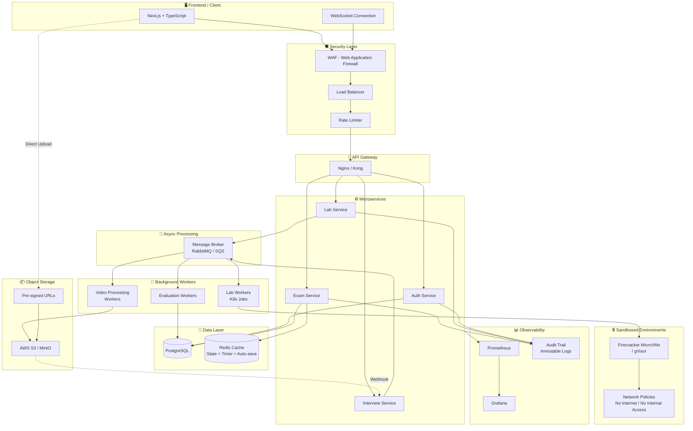
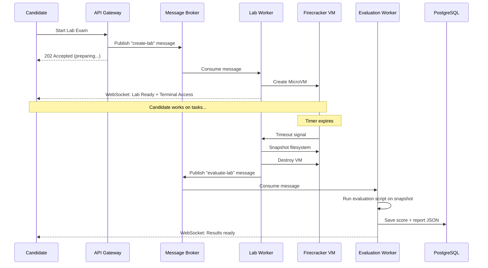
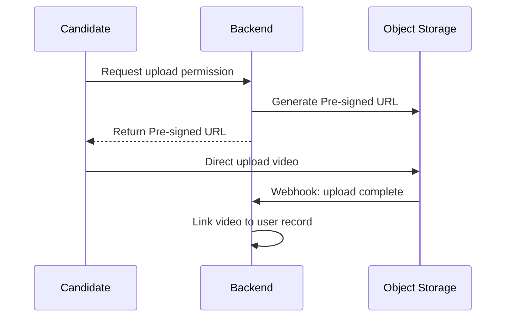
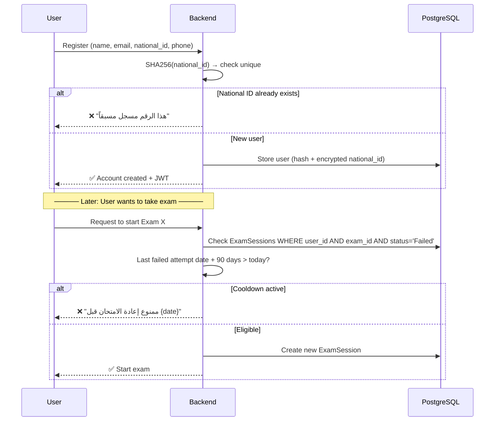
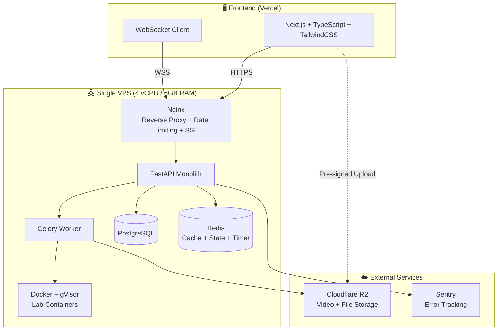
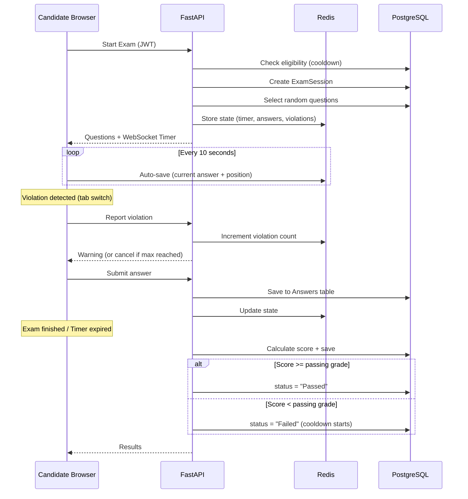
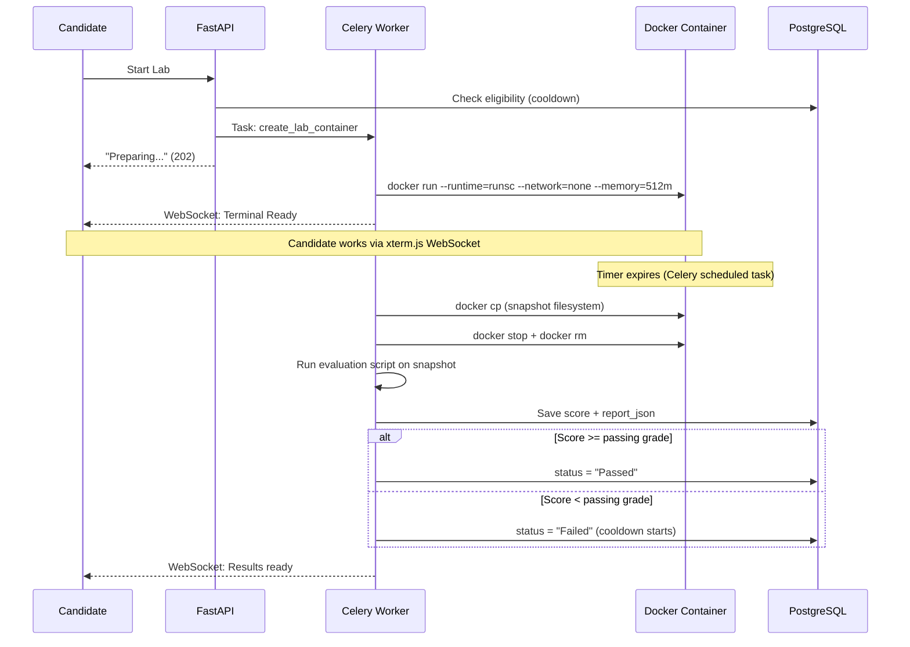
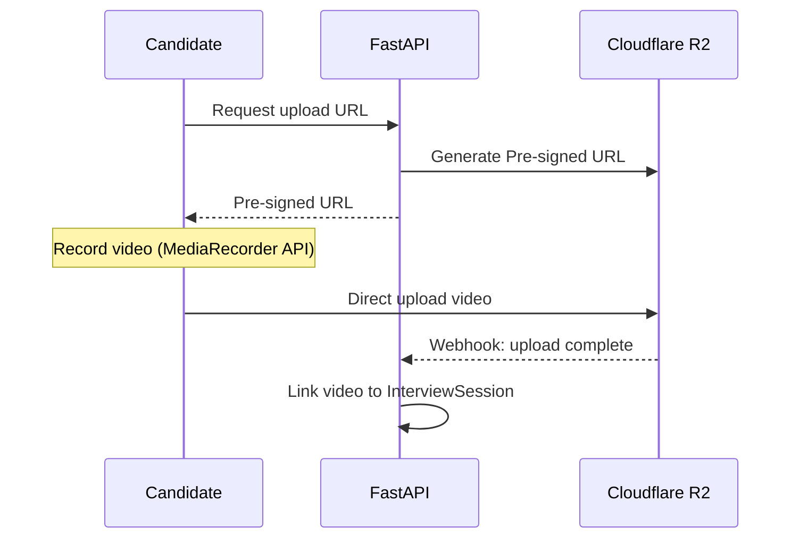
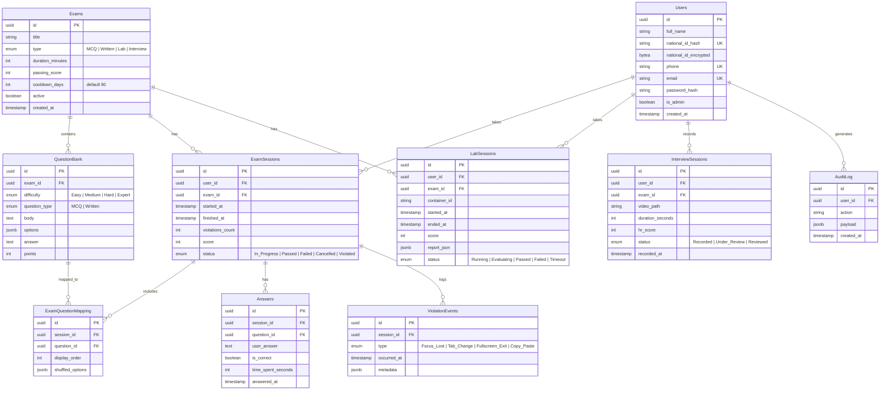

# Technical Assessment Platform - System Design

## Overview
منصة تقييم تقني متكاملة لاختبار المتقدمين للوظائف عبر 3 مراحل أساسية.

---

## High-Level Architecture



---

## Assessment Phases

### Phase 1: MCQ / Written Assessment
- Multiple Choice + Written Questions
- **Server-Side Timer** عبر WebSocket (مش Client-Side عشان محدش يتلاعب)
- Full Screen Mode مع نظام Violations
- منع Copy/Paste و Right Click
- تسجيل كل أحداث الغش (Focus Lost, Tab Change, Fullscreen Exit)
- إلغاء الامتحان بعد عدد معين من المخالفات (configurable)
- **Auto-save** كل 10 ثواني للـ Redis

### Phase 2: Linux Practical Lab
- كل ممتحن يتعمله **Firecracker MicroVM** مستقلة (مش Docker عادي)
- Network Policies صارمة — لا إنترنت، لا وصول للـ Internal Network
- الـ Evaluation Script يشتغل على **Snapshot** من الـ Filesystem
- تقييم تلقائي + تخزين النتيجة كـ JSON

**Workflow:**


### Phase 3: One-Way HR Interview
- أسئلة عشوائية أو ثابتة
- تسجيل فيديو مباشر
- رفع الفيديو عبر **Pre-signed URLs** مباشرة للـ S3
- S3 Webhook يبلغ الـ Backend إن الفيديو جاهز

**Video Upload Flow:**


---

## Database Schema


---

## Key Design Decisions

### 1. Security - Lab Isolation
| Approach | Risk Level | Notes |
|----------|-----------|-------|
| Docker (raw) | ❌ High | Container breakout possible |
| Docker + gVisor | ✅ Medium | Kernel-level sandboxing |
| Firecracker MicroVM | ✅ Low | Full VM isolation, same as AWS Lambda |

### 2. National ID Protection
```
┌─────────────────────────────────────────────┐
│  national_id_hash   = SHA256(national_id)   │  → Unique Constraint (prevent duplicates)
│  national_id_encrypted = AES256(national_id)│  → HR can decrypt when needed
└─────────────────────────────────────────────┘
```

### 3. State Management (Exam Resilience)
```
Frontend → Auto-save every 10s → Redis
                                   ├── Current question index
                                   ├── Answers so far
                                   ├── Remaining time (server-side)
                                   └── Violation count

On reconnect → Read from Redis → Resume exactly where left off
```

### 4. Question Randomization
- أسئلة عشوائية من الـ Question Bank حسب التوزيع:
  - 5 Easy | 10 Medium | 4 Hard | 1 Expert
- Shuffle ترتيب الأسئلة
- Shuffle ترتيب الإجابات (MCQ)
- تتبع أي أسئلة اتعرضت على مين (ExamQuestionMapping)

---

## Tech Stack

| Layer | Technology |
|-------|-----------|
| Frontend | Next.js, TypeScript, TailwindCSS |
| Real-time | WebSocket (Socket.IO) |
| Backend | FastAPI (Python) |
| Database | PostgreSQL |
| Cache | Redis |
| Message Broker | RabbitMQ / AWS SQS |
| Object Storage | AWS S3 / MinIO |
| Lab Isolation | Firecracker / gVisor |
| Orchestration | Kubernetes |
| Gateway | Nginx / Kong |
| Monitoring | Prometheus + Grafana |
| Security | WAF + Rate Limiter |
| Audit | Immutable Append-only Logs |

---

## Scalability Considerations

- **Horizontal Scaling**: كل Service يقدر يتعمله Scale مستقل
- **Message Broker**: يضمن إن الـ System ميقعش تحت الضغط (Spiky Traffic)
- **Pre-signed URLs**: الـ Backend مش بيتحمل bandwidth رفع الفيديوهات
- **Redis**: يقلل الـ Load على PostgreSQL للعمليات المتكررة (Timer, State)
- **K8s Jobs**: كل Lab بيتعمله Job مستقلة بتمسح نفسها بعد ما تخلص

---

## Future Enhancements
- AI Evaluation للـ Linux Lab (تقييم ذكي بدل Scripts ثابتة)
- AI Analysis للـ HR Interview (تحليل لغة الجسد والإجابات)
- توليد امتحانات جديدة تلقائياً من Question Bank
- Dashboard للإحصائيات وتقارير التوظيف
- Ranking System للممتحنين
- Video Storage Retention Policy (نقل لـ Cold Storage بعد 90 يوم)


بدايه في الاول


______________________________________________________________________________________________________________________________________________________________________________________________________________________________________________________

## Technical Assessment Platform - MVP

## Overview
منصة تقييم تقني لاختبار المتقدمين للوظائف عبر 3 مراحل: MCQ/Written، Linux Lab، One-Way Interview.

**Target:** 100 user/day | Single VPS | ~$25-50/mo

---

## Registration & Eligibility Flow

### القواعد:
1. المستخدم **لازم يسجل أولاً** ويدخل الرقم القومي
2. الرقم القومي **لا يتكرر** — شخص واحد = حساب واحد
3. لو فشل في امتحان → **ممنوع يدخله تاني إلا بعد 3 شهور**
4. الـ Cooldown بالامتحان مش بالمنصة (لو فشل في MCQ يقدر يدخل Lab عادي)



### الـ Cooldown Logic (Backend):

```python
from datetime import datetime, timedelta

COOLDOWN_DAYS = 90

async def check_eligibility(user_id: str, exam_id: str, db: Session) -> dict:
    last_failed = db.query(ExamSession).filter(
        ExamSession.user_id == user_id,
        ExamSession.exam_id == exam_id,
        ExamSession.status == "Failed"
    ).order_by(ExamSession.finished_at.desc()).first()

    if last_failed:
        eligible_date = last_failed.finished_at + timedelta(days=COOLDOWN_DAYS)
        if datetime.utcnow() < eligible_date:
            return {
                "eligible": False,
                "retry_after": eligible_date.isoformat(),
                "message": f"ممنوع إعادة الامتحان قبل {eligible_date.strftime('%Y-%m-%d')}"
            }

    return {"eligible": True}
```

---

## Architecture



---

## Assessment Phases

### Phase 1: MCQ / Written Assessment



**Features:**
- Full Screen Mode (Fullscreen API)
- Server-Side Timer عبر WebSocket
- Violation System (focus lost, tab change, fullscreen exit, copy/paste)
- Auto-save كل 10 ثواني للـ Redis
- Random question selection + shuffling
- Auto-grading for MCQ
- لو النت فصل → يرجع من Redis لنفس النقطة

---

### Phase 2: Linux Practical Lab



**Security:**
```
Docker flags:
  --runtime=runsc          # gVisor kernel isolation
  --network=none           # لا إنترنت
  --memory=512m            # Max RAM
  --cpus=1                 # Max CPU
  --pids-limit=100         # Prevent fork bombs
  --read-only              # Root filesystem read-only
  --tmpfs /tmp:size=100m   # Writable tmp only
```

---

### Phase 3: One-Way HR Interview



**Note:** الـ Interview مفيهوش Pass/Fail تلقائي — HR هو اللي بيقيّم يدوي.

---

## Database Schema



---

## Tech Stack

| Layer | Technology | Cost |
|-------|-----------|------|
| Frontend | Next.js + TypeScript + TailwindCSS (Vercel Free) | $0 |
| Backend | FastAPI (Python) | included |
| Task Queue | Celery + Redis as broker | included |
| Database | PostgreSQL 16 | included |
| Cache/State | Redis 7 | included |
| Lab Runtime | Docker + gVisor (runsc) | included |
| Web Terminal | xterm.js + WebSocket | included |
| Storage | Cloudflare R2 (10GB Free) | $0-5/mo |
| Reverse Proxy | Nginx + Let's Encrypt | included |
| Server | Single VPS (4 vCPU, 8GB RAM) | ~$20-40/mo |
| Error Tracking | Sentry Free Tier | $0 |
| Domain | Cloudflare | ~$10/yr |
| **Total** | | **~$25-50/mo** |

---

## Infrastructure (docker-compose.yml)

```yaml
version: "3.8"

services:
  api:
    build: ./backend
    ports:
      - "8000:8000"
    environment:
      - DATABASE_URL=postgresql://user:pass@db:5432/assessments
      - REDIS_URL=redis://redis:6379
      - S3_ENDPOINT=${S3_ENDPOINT}
      - S3_ACCESS_KEY=${S3_ACCESS_KEY}
      - S3_SECRET_KEY=${S3_SECRET_KEY}
      - ENCRYPTION_KEY=${ENCRYPTION_KEY}
      - JWT_SECRET=${JWT_SECRET}
    depends_on:
      - db
      - redis
    volumes:
      - /var/run/docker.sock:/var/run/docker.sock
    restart: unless-stopped

  celery-worker:
    build: ./backend
    command: celery -A app.worker worker --loglevel=info --concurrency=4
    environment:
      - DATABASE_URL=postgresql://user:pass@db:5432/assessments
      - REDIS_URL=redis://redis:6379
    depends_on:
      - db
      - redis
    volumes:
      - /var/run/docker.sock:/var/run/docker.sock
    restart: unless-stopped

  celery-beat:
    build: ./backend
    command: celery -A app.worker beat --loglevel=info
    environment:
      - REDIS_URL=redis://redis:6379
    depends_on:
      - redis
    restart: unless-stopped

  db:
    image: postgres:16-alpine
    volumes:
      - pgdata:/var/lib/postgresql/data
    environment:
      - POSTGRES_DB=assessments
      - POSTGRES_USER=user
      - POSTGRES_PASSWORD=${DB_PASSWORD}
    restart: unless-stopped

  redis:
    image: redis:7-alpine
    command: redis-server --maxmemory 256mb --maxmemory-policy allkeys-lru
    volumes:
      - redisdata:/data
    restart: unless-stopped

  nginx:
    image: nginx:alpine
    ports:
      - "80:80"
      - "443:443"
    volumes:
      - ./nginx/nginx.conf:/etc/nginx/nginx.conf
      - ./nginx/certs:/etc/nginx/certs
    depends_on:
      - api
    restart: unless-stopped

volumes:
  pgdata:
  redisdata:
```

---

## Security (Day 1)

```
✅ HTTPS (Let's Encrypt via Certbot)
✅ JWT with refresh tokens
✅ National ID: SHA256 Hash (unique constraint) + AES-256 encrypted
✅ Rate limiting: 10 req/s per IP (Nginx)
✅ Lab containers: --runtime=runsc (gVisor)
✅ Lab containers: --network=none
✅ Lab containers: --memory=512m --cpus=1 --pids-limit=100
✅ Input validation: Pydantic models
✅ SQL injection: SQLAlchemy ORM
✅ CORS: whitelist frontend domain only
✅ Secrets: .env file (never committed)
✅ Evaluation: runs on snapshot not live container
✅ Cooldown enforcement: server-side (can't bypass from frontend)
```

---

## Key Design Decisions

### National ID Protection
```
Registration:
  national_id → SHA256(national_id) → store as national_id_hash (UNIQUE)
  national_id → AES256(national_id) → store as national_id_encrypted
  
Duplicate check: compare hash (fast, O(1) with index)
HR needs original: decrypt with ENCRYPTION_KEY
```

### Exam Cooldown (3 Months)
```
ExamSessions table:
  status = "Failed" + finished_at = "2026-03-01"
  
User tries again on 2026-04-15:
  eligible_date = 2026-03-01 + 90 days = 2026-05-30
  today (2026-04-15) < eligible_date → ❌ BLOCKED

User tries again on 2026-06-05:
  today (2026-06-05) > eligible_date → ✅ ALLOWED
```

### State Management (Disconnect Resilience)
```
Frontend → Auto-save every 10s → Redis
                                   ├── Current question index
                                   ├── Answers submitted
                                   ├── Remaining time (server-authoritative)
                                   └── Violation count

Internet drops → Reconnect → Read Redis → Resume same point
```

### Question Randomization
- توزيع: 5 Easy | 10 Medium | 4 Hard | 1 Expert
- Shuffle ترتيب الأسئلة
- Shuffle ترتيب الإجابات (MCQ)
- ExamQuestionMapping يتتبع أي أسئلة اتعرضت على مين

---

## Project Structure

```
project/
├── docker-compose.yml
├── .env                         # Secrets (not in git)
├── .env.example
├── nginx/
│   ├── nginx.conf
│   └── certs/
├── backend/
│   ├── Dockerfile
│   ├── requirements.txt
│   ├── alembic/                 # DB migrations
│   │   └── versions/
│   ├── app/
│   │   ├── main.py              # FastAPI app + WebSocket
│   │   ├── config.py            # Settings (from env)
│   │   ├── dependencies.py      # DI (db session, current user)
│   │   ├── models/              # SQLAlchemy models
│   │   │   ├── user.py
│   │   │   ├── exam.py
│   │   │   ├── question.py
│   │   │   └── session.py
│   │   ├── schemas/             # Pydantic schemas
│   │   │   ├── auth.py
│   │   │   ├── exam.py
│   │   │   └── lab.py
│   │   ├── api/                 # Route handlers
│   │   │   ├── auth.py          # Register + Login + National ID check
│   │   │   ├── exams.py         # Start exam + eligibility check
│   │   │   ├── labs.py
│   │   │   ├── interviews.py
│   │   │   └── admin.py
│   │   ├── services/
│   │   │   ├── auth_service.py
│   │   │   ├── eligibility.py   # Cooldown logic
│   │   │   ├── exam_service.py
│   │   │   ├── lab_service.py
│   │   │   └── evaluation.py
│   │   ├── worker.py            # Celery tasks
│   │   └── websocket.py         # Timer + Terminal
│   ├── evaluation_scripts/
│   │   ├── linux_basics.sh
│   │   └── nginx_setup.sh
│   └── tests/
├── frontend/
│   ├── package.json
│   ├── src/
│   │   ├── app/
│   │   │   ├── page.tsx
│   │   │   ├── register/
│   │   │   ├── login/
│   │   │   ├── exam/
│   │   │   ├── lab/
│   │   │   ├── interview/
│   │   │   └── admin/
│   │   ├── components/
│   │   │   ├── ExamScreen.tsx
│   │   │   ├── Terminal.tsx
│   │   │   ├── VideoRecorder.tsx
│   │   │   └── CooldownNotice.tsx
│   │   └── lib/
│   │       ├── api.ts
│   │       ├── websocket.ts
│   │       └── auth.ts
│   └── public/
└── lab-images/
    ├── linux-basics/Dockerfile
    └── nginx-setup/Dockerfile
```

---

## Sprint Plan

### Sprint 1 (Week 1-2): Registration + Auth
- [ ] User Registration (name, email, phone, national_id)
- [ ] National ID: Hash + AES-256 + Unique check
- [ ] Login (JWT + Refresh Token)
- [ ] Eligibility service (cooldown logic)
- [ ] Admin panel لإدارة الأسئلة والامتحانات
- [ ] Question Bank CRUD
- [ ] Docker Compose setup

### Sprint 2 (Week 3-4): MCQ/Written Exam
- [ ] Eligibility check before starting
- [ ] Full Screen Exam Mode
- [ ] Server-side Timer (WebSocket)
- [ ] Violation Detection + System
- [ ] Auto-save to Redis
- [ ] Random question selection + shuffling
- [ ] Auto-grading → Pass/Fail + Cooldown trigger

### Sprint 3 (Week 5-6): Linux Lab
- [ ] Eligibility check before starting
- [ ] Docker + gVisor container creation
- [ ] Web terminal (xterm.js + WebSocket)
- [ ] Timer + auto-destroy (Celery Beat)
- [ ] Filesystem snapshot + evaluation
- [ ] Score → Pass/Fail + Cooldown trigger

### Sprint 4 (Week 7-8): One-Way Interview
- [ ] Video recording UI (MediaRecorder API)
- [ ] Pre-signed URL upload to R2
- [ ] Link video to user session
- [ ] HR review interface (watch + score)

### Sprint 5 (Week 9-10): Polish + Launch
- [ ] Results dashboard + cooldown status display
- [ ] Email notifications (invite, results, cooldown expiry)
- [ ] Basic analytics
- [ ] Security audit
- [ ] Load testing (100 users)
- [ ] Deploy to production

---

## API Endpoints (Key)

```
POST   /api/auth/register          # Register + National ID check
POST   /api/auth/login             # Login → JWT
POST   /api/auth/refresh           # Refresh token

GET    /api/exams                  # List available exams
GET    /api/exams/{id}/eligibility # Check if user can take exam
POST   /api/exams/{id}/start       # Start exam (checks cooldown)
POST   /api/exams/{id}/answer      # Submit answer
POST   /api/exams/{id}/finish      # End exam

POST   /api/labs/{id}/start        # Start lab (checks cooldown)
GET    /api/labs/{id}/status       # Lab status
POST   /api/labs/{id}/stop         # Manual stop

POST   /api/interviews/{id}/upload-url   # Get pre-signed URL
POST   /api/interviews/{id}/complete     # Mark as recorded

GET    /api/admin/users            # List users
GET    /api/admin/results          # All results
GET    /api/admin/results/{user}   # User results + cooldown info
```

---

## Scaling Roadmap

| Signal | Action |
|--------|--------|
| > 500 users/day | أضف Load Balancer + سيرفر ثاني |
| > 50 concurrent labs | انقل Labs لسيرفر مستقل |
| > 2000 users/day | فصّل Microservices |
| > 100 concurrent labs | Kubernetes + Firecracker |
| Revenue > $5K/mo | WAF + Full Monitoring |

