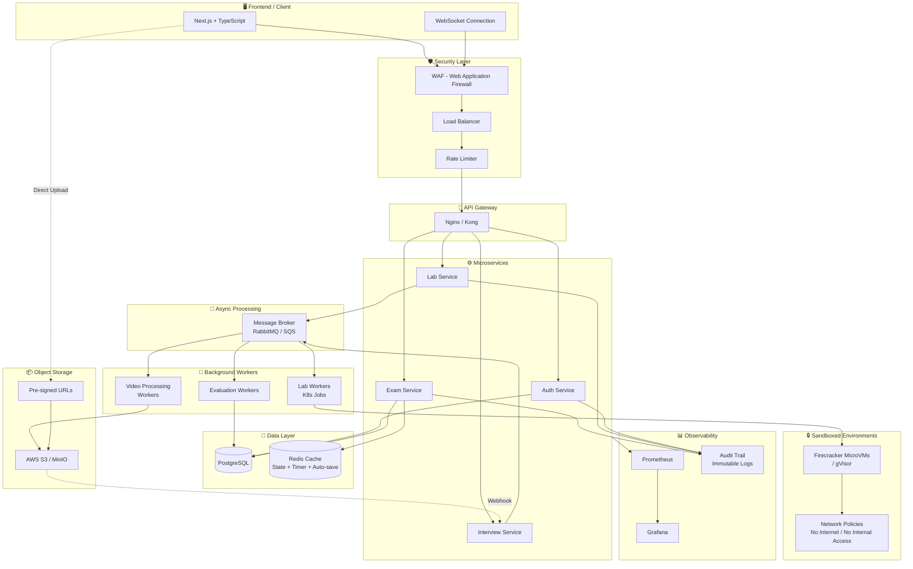
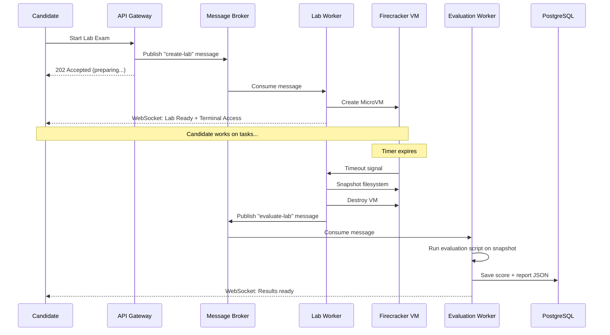
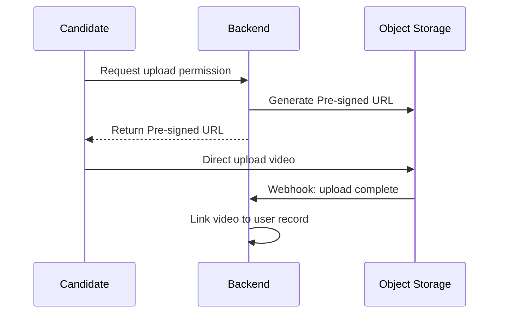
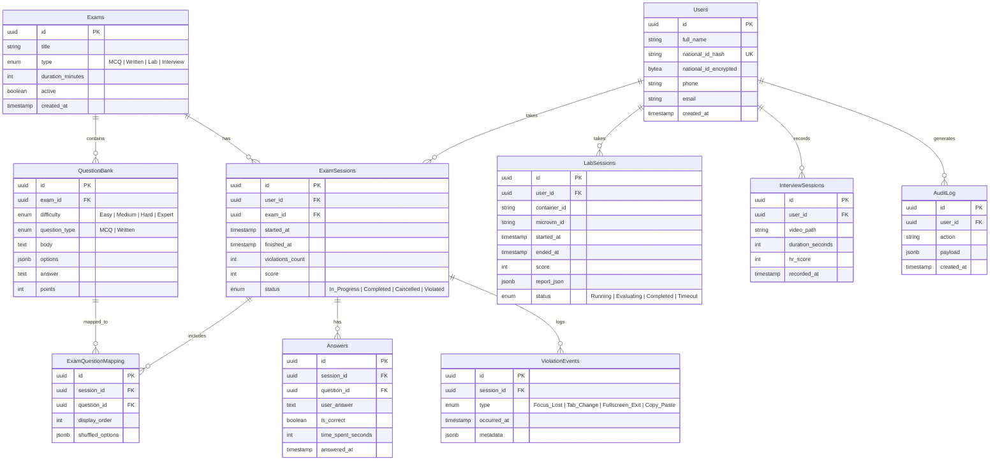
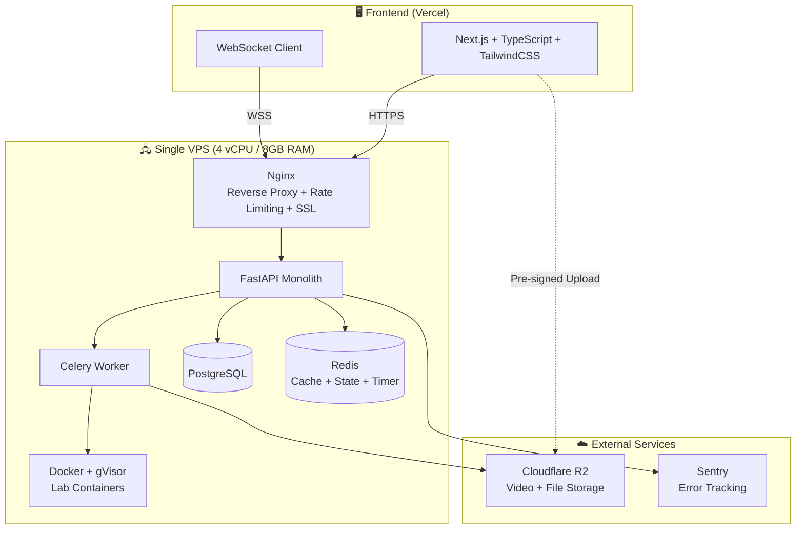
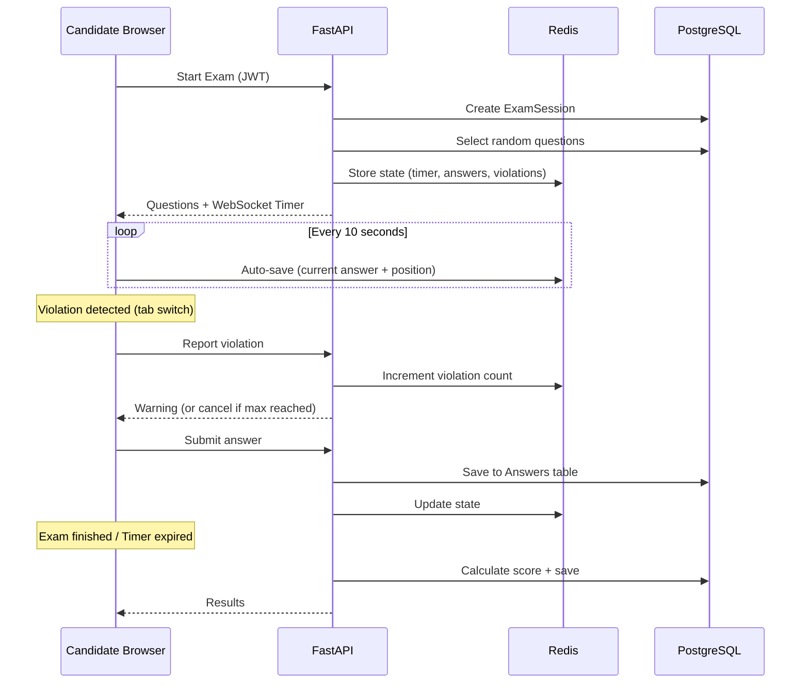
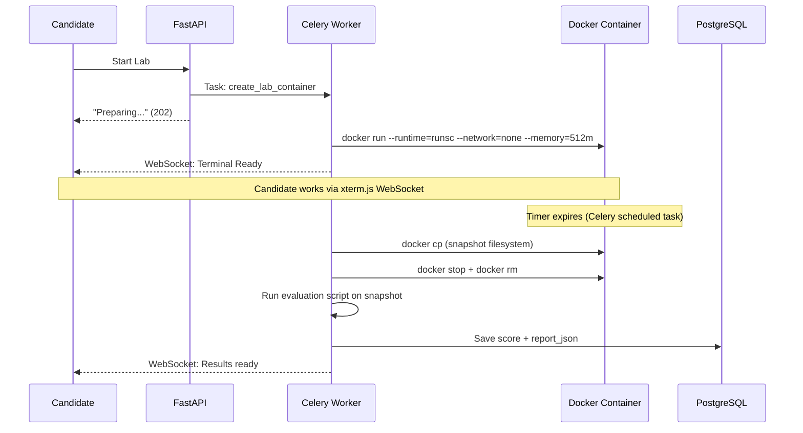
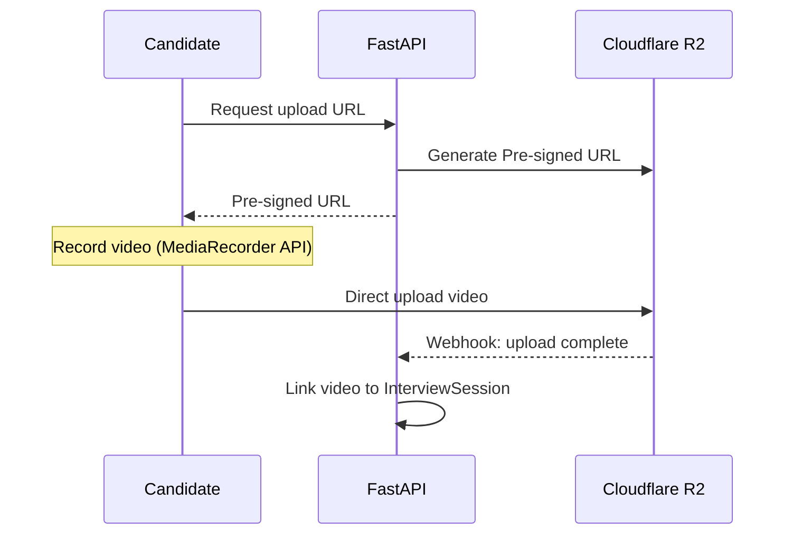
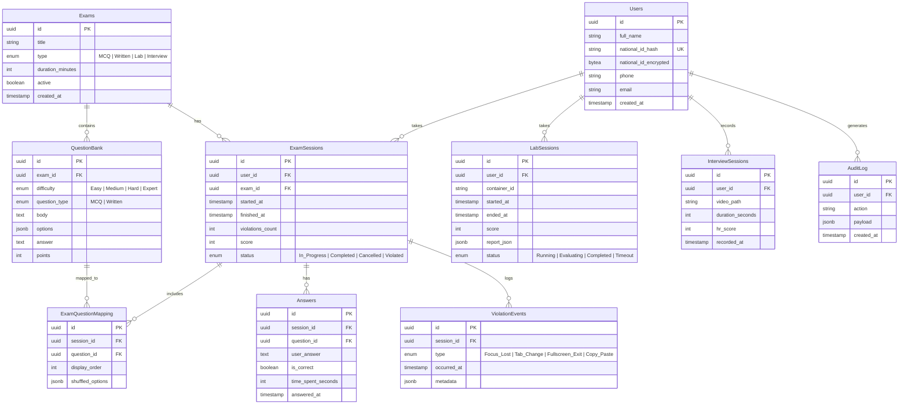

# Technical Assessment Platform - System Design

## Overview
منصة تقييم تقني متكاملة لاختبار المتقدمين للوظائف عبر 3 مراحل أساسية.

---

## High-Level Architecture



---

## Assessment Phases

### Phase 1: MCQ / Written Assessment
- Multiple Choice + Written Questions
- **Server-Side Timer** عبر WebSocket (مش Client-Side عشان محدش يتلاعب)
- Full Screen Mode مع نظام Violations
- منع Copy/Paste و Right Click
- تسجيل كل أحداث الغش (Focus Lost, Tab Change, Fullscreen Exit)
- إلغاء الامتحان بعد عدد معين من المخالفات (configurable)
- **Auto-save** كل 10 ثواني للـ Redis

### Phase 2: Linux Practical Lab
- كل ممتحن يتعمله **Firecracker MicroVM** مستقلة (مش Docker عادي)
- Network Policies صارمة — لا إنترنت، لا وصول للـ Internal Network
- الـ Evaluation Script يشتغل على **Snapshot** من الـ Filesystem
- تقييم تلقائي + تخزين النتيجة كـ JSON

**Workflow:**


### Phase 3: One-Way HR Interview
- أسئلة عشوائية أو ثابتة
- تسجيل فيديو مباشر
- رفع الفيديو عبر **Pre-signed URLs** مباشرة للـ S3
- S3 Webhook يبلغ الـ Backend إن الفيديو جاهز

**Video Upload Flow:**


---

## Database Schema



---

## Key Design Decisions

### 1. Security - Lab Isolation
| Approach | Risk Level | Notes |
|----------|-----------|-------|
| Docker (raw) | ❌ High | Container breakout possible |
| Docker + gVisor | ✅ Medium | Kernel-level sandboxing |
| Firecracker MicroVM | ✅ Low | Full VM isolation, same as AWS Lambda |

### 2. National ID Protection
```
┌─────────────────────────────────────────────┐
│  national_id_hash   = SHA256(national_id)   │  → Unique Constraint (prevent duplicates)
│  national_id_encrypted = AES256(national_id)│  → HR can decrypt when needed
└─────────────────────────────────────────────┘
```

### 3. State Management (Exam Resilience)
```
Frontend → Auto-save every 10s → Redis
                                   ├── Current question index
                                   ├── Answers so far
                                   ├── Remaining time (server-side)
                                   └── Violation count

On reconnect → Read from Redis → Resume exactly where left off
```

### 4. Question Randomization
- أسئلة عشوائية من الـ Question Bank حسب التوزيع:
  - 5 Easy | 10 Medium | 4 Hard | 1 Expert
- Shuffle ترتيب الأسئلة
- Shuffle ترتيب الإجابات (MCQ)
- تتبع أي أسئلة اتعرضت على مين (ExamQuestionMapping)

---

## Tech Stack

| Layer | Technology |
|-------|-----------|
| Frontend | Next.js, TypeScript, TailwindCSS |
| Real-time | WebSocket (Socket.IO) |
| Backend | FastAPI (Python) |
| Database | PostgreSQL |
| Cache | Redis |
| Message Broker | RabbitMQ / AWS SQS |
| Object Storage | AWS S3 / MinIO |
| Lab Isolation | Firecracker / gVisor |
| Orchestration | Kubernetes |
| Gateway | Nginx / Kong |
| Monitoring | Prometheus + Grafana |
| Security | WAF + Rate Limiter |
| Audit | Immutable Append-only Logs |

---

## Scalability Considerations

- **Horizontal Scaling**: كل Service يقدر يتعمله Scale مستقل
- **Message Broker**: يضمن إن الـ System ميقعش تحت الضغط (Spiky Traffic)
- **Pre-signed URLs**: الـ Backend مش بيتحمل bandwidth رفع الفيديوهات
- **Redis**: يقلل الـ Load على PostgreSQL للعمليات المتكررة (Timer, State)
- **K8s Jobs**: كل Lab بيتعمله Job مستقلة بتمسح نفسها بعد ما تخلص

---

## Future Enhancements
- AI Evaluation للـ Linux Lab (تقييم ذكي بدل Scripts ثابتة)
- AI Analysis للـ HR Interview (تحليل لغة الجسد والإجابات)
- توليد امتحانات جديدة تلقائياً من Question Bank
- Dashboard للإحصائيات وتقارير التوظيف
- Ranking System للممتحنين
- Video Storage Retention Policy (نقل لـ Cold Storage بعد 90 يوم)


بدايه في الاول


______________________________________________________________________________________________________________________________________________________________________________________________________________________________________________________

# Technical Assessment Platform - MVP

## Overview
منصة تقييم تقني لاختبار المتقدمين للوظائف عبر 3 مراحل: MCQ/Written، Linux Lab، One-Way Interview.

**Target:** 100 user/day | Single VPS | ~$25-50/mo

---

## Architecture



---

## Assessment Phases

### Phase 1: MCQ / Written Assessment



**Features:**
- Full Screen Mode (Fullscreen API)
- Server-Side Timer عبر WebSocket
- Violation System (focus lost, tab change, fullscreen exit, copy/paste)
- Auto-save كل 10 ثواني للـ Redis
- Random question selection + shuffling
- Auto-grading for MCQ
- لو النت فصل → يرجع من Redis لنفس النقطة

---

### Phase 2: Linux Practical Lab



**Security:**
```
Docker flags:
  --runtime=runsc          # gVisor kernel isolation
  --network=none           # لا إنترنت
  --memory=512m            # Max RAM
  --cpus=1                 # Max CPU
  --pids-limit=100         # Prevent fork bombs
  --read-only              # Root filesystem read-only
  --tmpfs /tmp:size=100m   # Writable tmp only
```

**Evaluation يشتغل على Snapshot مش على الـ Container مباشرة** — عشان الممتحن ميقدرش يضلل الـ Script.

---

### Phase 3: One-Way HR Interview



**Features:**
- أسئلة عشوائية أو ثابتة تظهر واحد واحد
- تسجيل فيديو عبر المتصفح (MediaRecorder API)
- رفع مباشر للـ R2 بدون مرور على الـ Backend
- HR Review interface لمشاهدة وتقييم الفيديوهات

---

## Database Schema



---

## Tech Stack

| Layer | Technology | Cost |
|-------|-----------|------|
| Frontend | Next.js + TypeScript + TailwindCSS (Vercel Free) | $0 |
| Backend | FastAPI (Python) | included |
| Task Queue | Celery + Redis as broker | included |
| Database | PostgreSQL 16 | included |
| Cache/State | Redis 7 | included |
| Lab Runtime | Docker + gVisor (runsc) | included |
| Web Terminal | xterm.js + WebSocket | included |
| Storage | Cloudflare R2 (10GB Free) | $0-5/mo |
| Reverse Proxy | Nginx + Let's Encrypt | included |
| Server | Single VPS (4 vCPU, 8GB RAM) | ~$20-40/mo |
| Error Tracking | Sentry Free Tier | $0 |
| Domain | Cloudflare | ~$10/yr |
| **Total** | | **~$25-50/mo** |

---

## Infrastructure

### docker-compose.yml

```yaml
version: "3.8"

services:
  api:
    build: ./backend
    ports:
      - "8000:8000"
    environment:
      - DATABASE_URL=postgresql://user:pass@db:5432/assessments
      - REDIS_URL=redis://redis:6379
      - S3_ENDPOINT=https://xxx.r2.cloudflarestorage.com
      - S3_ACCESS_KEY=${S3_ACCESS_KEY}
      - S3_SECRET_KEY=${S3_SECRET_KEY}
      - ENCRYPTION_KEY=${ENCRYPTION_KEY}
      - JWT_SECRET=${JWT_SECRET}
    depends_on:
      - db
      - redis
    volumes:
      - /var/run/docker.sock:/var/run/docker.sock
    restart: unless-stopped

  celery-worker:
    build: ./backend
    command: celery -A app.worker worker --loglevel=info --concurrency=4
    environment:
      - DATABASE_URL=postgresql://user:pass@db:5432/assessments
      - REDIS_URL=redis://redis:6379
    depends_on:
      - db
      - redis
    volumes:
      - /var/run/docker.sock:/var/run/docker.sock
    restart: unless-stopped

  celery-beat:
    build: ./backend
    command: celery -A app.worker beat --loglevel=info
    environment:
      - REDIS_URL=redis://redis:6379
    depends_on:
      - redis
    restart: unless-stopped

  db:
    image: postgres:16-alpine
    volumes:
      - pgdata:/var/lib/postgresql/data
    environment:
      - POSTGRES_DB=assessments
      - POSTGRES_USER=user
      - POSTGRES_PASSWORD=${DB_PASSWORD}
    restart: unless-stopped

  redis:
    image: redis:7-alpine
    command: redis-server --maxmemory 256mb --maxmemory-policy allkeys-lru
    volumes:
      - redisdata:/data
    restart: unless-stopped

  nginx:
    image: nginx:alpine
    ports:
      - "80:80"
      - "443:443"
    volumes:
      - ./nginx/nginx.conf:/etc/nginx/nginx.conf
      - ./nginx/certs:/etc/nginx/certs
    depends_on:
      - api
    restart: unless-stopped

volumes:
  pgdata:
  redisdata:
```

### nginx.conf (Key Parts)

```nginx
upstream api {
    server api:8000;
}

server {
    listen 443 ssl;
    server_name yourdomain.com;

    ssl_certificate     /etc/nginx/certs/fullchain.pem;
    ssl_certificate_key /etc/nginx/certs/privkey.pem;

    # Rate limiting
    limit_req_zone $binary_remote_addr zone=api:10m rate=10r/s;
    limit_req zone=api burst=20 nodelay;

    # API
    location /api/ {
        proxy_pass http://api;
        proxy_set_header Host $host;
        proxy_set_header X-Real-IP $remote_addr;
    }

    # WebSocket
    location /ws/ {
        proxy_pass http://api;
        proxy_http_version 1.1;
        proxy_set_header Upgrade $http_upgrade;
        proxy_set_header Connection "upgrade";
    }
}
```

---

## Security (Day 1)

```
✅ HTTPS (Let's Encrypt via Certbot)
✅ JWT with refresh tokens (short-lived access tokens)
✅ National ID: SHA256 Hash (unique) + AES-256 encrypted (readable)
✅ Rate limiting: 10 req/s per IP (Nginx)
✅ Lab containers: --runtime=runsc (gVisor)
✅ Lab containers: --network=none (no internet access)
✅ Lab containers: --memory=512m --cpus=1 --pids-limit=100
✅ Input validation: Pydantic models on every endpoint
✅ SQL injection: SQLAlchemy ORM (no raw queries)
✅ CORS: whitelist frontend domain only
✅ Secrets: environment variables (never in code)
✅ Evaluation: runs on filesystem snapshot (not live container)
```

---

## Key Design Decisions

### National ID Protection
```
┌─────────────────────────────────────────────┐
│  national_id_hash   = SHA256(id)            │  → Unique Constraint
│  national_id_encrypted = AES256(id)         │  → HR can decrypt
└─────────────────────────────────────────────┘
```

### State Management (Disconnect Resilience)
```
Frontend → Auto-save every 10s → Redis
                                   ├── Current question index
                                   ├── Answers submitted
                                   ├── Remaining time (server-authoritative)
                                   └── Violation count

Internet drops → Reconnect → Read Redis → Resume same point
```

### Question Randomization
- توزيع: 5 Easy | 10 Medium | 4 Hard | 1 Expert
- Shuffle ترتيب الأسئلة
- Shuffle ترتيب الإجابات (MCQ)
- ExamQuestionMapping يتتبع أي أسئلة اتعرضت على مين

---

## Project Structure

```
project/
├── docker-compose.yml
├── .env                         # Secrets (not in git)
├── .env.example                 # Template
├── nginx/
│   ├── nginx.conf
│   └── certs/
├── backend/
│   ├── Dockerfile
│   ├── requirements.txt
│   ├── alembic/                 # DB migrations
│   │   └── versions/
│   ├── app/
│   │   ├── main.py              # FastAPI app + WebSocket
│   │   ├── config.py            # Settings (from env)
│   │   ├── dependencies.py      # DI (db session, current user)
│   │   ├── models/              # SQLAlchemy models
│   │   │   ├── user.py
│   │   │   ├── exam.py
│   │   │   ├── question.py
│   │   │   └── session.py
│   │   ├── schemas/             # Pydantic schemas
│   │   │   ├── auth.py
│   │   │   ├── exam.py
│   │   │   └── lab.py
│   │   ├── api/                 # Route handlers
│   │   │   ├── auth.py
│   │   │   ├── exams.py
│   │   │   ├── labs.py
│   │   │   ├── interviews.py
│   │   │   └── admin.py
│   │   ├── services/            # Business logic
│   │   │   ├── auth_service.py
│   │   │   ├── exam_service.py
│   │   │   ├── lab_service.py
│   │   │   └── evaluation.py
│   │   ├── worker.py            # Celery tasks
│   │   └── websocket.py         # WS handlers (timer, terminal)
│   ├── evaluation_scripts/
│   │   ├── linux_basics.sh
│   │   └── nginx_setup.sh
│   └── tests/
│       ├── test_auth.py
│       ├── test_exam.py
│       └── test_lab.py
├── frontend/
│   ├── package.json
│   ├── next.config.js
│   ├── src/
│   │   ├── app/                 # Next.js App Router
│   │   │   ├── page.tsx         # Landing
│   │   │   ├── login/
│   │   │   ├── register/
│   │   │   ├── exam/
│   │   │   ├── lab/
│   │   │   ├── interview/
│   │   │   └── admin/
│   │   ├── components/
│   │   │   ├── ExamScreen.tsx   # Fullscreen exam UI
│   │   │   ├── Terminal.tsx     # xterm.js wrapper
│   │   │   ├── VideoRecorder.tsx
│   │   │   └── Timer.tsx
│   │   └── lib/
│   │       ├── api.ts           # Axios/fetch wrapper
│   │       ├── websocket.ts     # WS connection manager
│   │       └── auth.ts          # JWT handling
│   └── public/
└── lab-images/
    ├── linux-basics/
    │   └── Dockerfile
    └── nginx-setup/
        └── Dockerfile
```

---

## Sprint Plan

### Sprint 1 (Week 1-2): Auth + Admin
- [ ] User Registration + Login (JWT + Refresh Token)
- [ ] National ID validation (Hash + AES-256)
- [ ] Admin panel لإدارة الأسئلة والامتحانات
- [ ] Question Bank CRUD
- [ ] Docker Compose setup + deployment script

### Sprint 2 (Week 3-4): MCQ/Written Exam
- [ ] Full Screen Exam Mode
- [ ] Server-side Timer (WebSocket)
- [ ] Violation Detection + Violation System
- [ ] Auto-save to Redis (every 10s)
- [ ] Random question selection + shuffling
- [ ] Auto-grading for MCQ
- [ ] Reconnection resilience

### Sprint 3 (Week 5-6): Linux Lab
- [ ] Docker + gVisor container creation
- [ ] Web terminal (xterm.js + WebSocket)
- [ ] Timer + auto-destroy (Celery Beat)
- [ ] Filesystem snapshot + evaluation script
- [ ] Score calculation + JSON report
- [ ] Build 2-3 lab images

### Sprint 4 (Week 7-8): One-Way Interview
- [ ] Video recording UI (MediaRecorder API)
- [ ] Pre-signed URL upload to R2
- [ ] Link video to user session
- [ ] HR review interface (watch + score)
- [ ] Question display (one at a time)

### Sprint 5 (Week 9-10): Polish + Launch
- [ ] Results dashboard (candidate + admin views)
- [ ] Email notifications (exam invite, results)
- [ ] Basic analytics (pass rate, avg score)
- [ ] Security audit + hardening
- [ ] Load testing (simulate 100 users)
- [ ] Deploy to production VPS

---

## Scaling Roadmap

لما المنصة تكبر، هتحتاج تضيف حاجات تدريجياً:

| Signal | Action |
|--------|--------|
| > 500 users/day | أضف Load Balancer + سيرفر ثاني |
| > 50 concurrent labs | انقل Labs لسيرفر مستقل (8+ vCPU) |
| > 2000 users/day | فصّل Microservices |
| > 100 concurrent labs | انتقل لـ Kubernetes + Firecracker |
| Revenue > $5K/mo | أضف WAF + Full Monitoring (Prometheus/Grafana) |
| Enterprise clients | SOC2 Compliance + Audit Logs |

---

## Deployment (First Time)

```bash
# 1. SSH to VPS
ssh root@your-server

# 2. Install Docker + Docker Compose
curl -fsSL https://get.docker.com | sh
apt install docker-compose-plugin

# 3. Install gVisor
curl -fsSL https://gvisor.dev/archive.key | gpg --dearmor -o /usr/share/keyrings/gvisor-archive-keyring.gpg
echo "deb [arch=$(dpkg --print-architecture) signed-by=/usr/share/keyrings/gvisor-archive-keyring.gpg] https://storage.googleapis.com/gvisor/releases release main" | tee /etc/apt/sources.list.d/gvisor.list
apt update && apt install -y runsc
# Configure Docker to use gVisor
cat > /etc/docker/daemon.json << 'EOF'
{
  "runtimes": {
    "runsc": {
      "path": "/usr/bin/runsc"
    }
  }
}
EOF
systemctl restart docker

# 4. Clone project + setup
git clone your-repo /opt/assessment-platform
cd /opt/assessment-platform
cp .env.example .env
# Edit .env with real secrets

# 5. Build lab images
docker build -t lab-linux-basics ./lab-images/linux-basics/

# 6. Start everything
docker compose up -d

# 7. Run migrations
docker compose exec api alembic upgrade head

# 8. Create admin user
docker compose exec api python -m app.create_admin
```

---

## Sample Lab Image (Dockerfile)

```dockerfile
# lab-images/linux-basics/Dockerfile
FROM ubuntu:22.04

RUN apt-get update && apt-get install -y \
    nginx \
    vim \
    curl \
    net-tools \
    systemctl \
    && rm -rf /var/lib/apt/lists/*

# Setup tasks description
COPY tasks.md /home/candidate/TASKS.md
COPY .bashrc /root/.bashrc

WORKDIR /home/candidate
CMD ["/bin/bash"]
```

## Sample Evaluation Script

```bash
#!/bin/bash
# evaluation_scripts/linux_basics.sh
# Runs on filesystem snapshot, not live container

SNAPSHOT_PATH=$1
score=0
total=100
report=""

# Task 1: Nginx installed and configured (20 points)
if [ -f "$SNAPSHOT_PATH/etc/nginx/nginx.conf" ]; then
    score=$((score + 10))
    report="$report\n✅ Nginx config exists (+10)"
fi
if grep -q "proxy_pass" "$SNAPSHOT_PATH/etc/nginx/conf.d/default.conf" 2>/dev/null; then
    score=$((score + 10))
    report="$report\n✅ Proxy pass configured (+10)"
fi

# Task 2: Backup created (20 points)
if [ -f "$SNAPSHOT_PATH/backup/data.tar.gz" ]; then
    score=$((score + 20))
    report="$report\n✅ Backup file created (+20)"
fi

# Task 3: User created (20 points)
if grep -q "devops" "$SNAPSHOT_PATH/etc/passwd" 2>/dev/null; then
    score=$((score + 20))
    report="$report\n✅ User 'devops' created (+20)"
fi

# Task 4: Cron job (20 points)
if [ -f "$SNAPSHOT_PATH/var/spool/cron/crontabs/root" ]; then
    score=$((score + 20))
    report="$report\n✅ Cron job configured (+20)"
fi

# Task 5: Firewall rules (20 points)
if [ -f "$SNAPSHOT_PATH/etc/iptables/rules.v4" ]; then
    score=$((score + 20))
    report="$report\n✅ Firewall rules saved (+20)"
fi

# Output JSON
echo "{\"score\": $score, \"total\": $total, \"report\": \"$report\"}"
```

---
