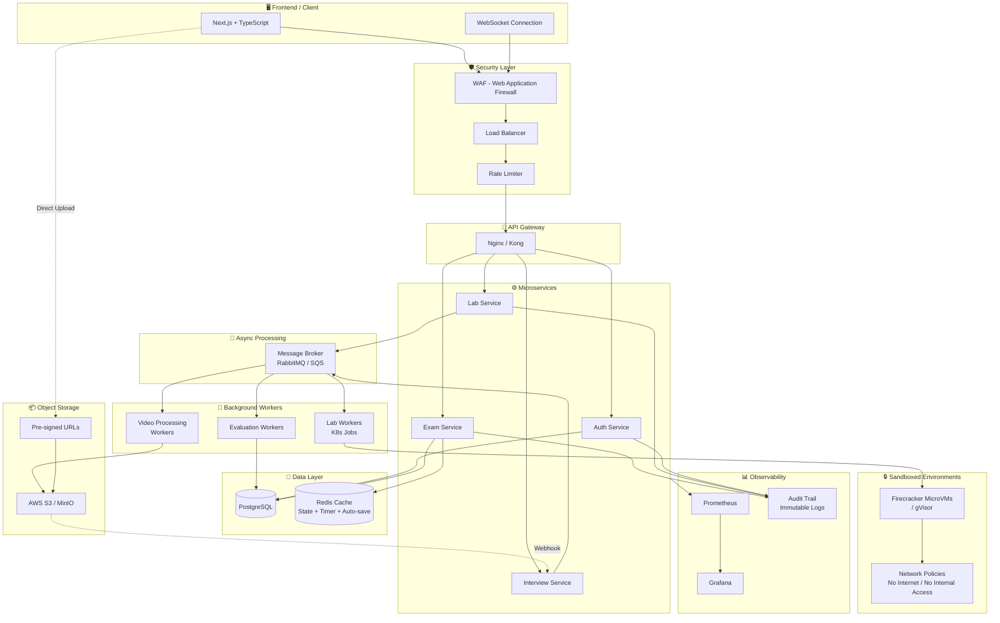
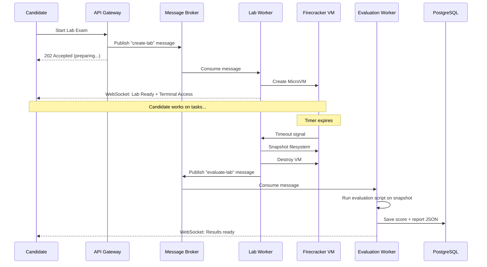
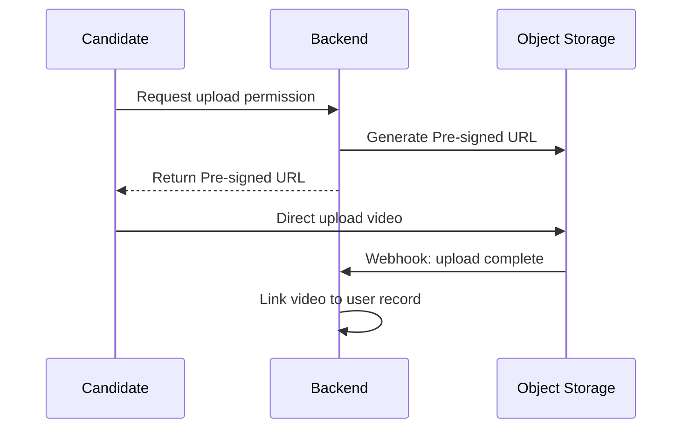

# Technical Assessment Platform - System Design

## Overview
منصة تقييم تقني متكاملة لاختبار المتقدمين للوظائف عبر 3 مراحل أساسية.

---

## High-Level Architecture



---

## Assessment Phases

### Phase 1: MCQ / Written Assessment
- Multiple Choice + Written Questions
- **Server-Side Timer** عبر WebSocket (مش Client-Side عشان محدش يتلاعب)
- Full Screen Mode مع نظام Violations
- منع Copy/Paste و Right Click
- تسجيل كل أحداث الغش (Focus Lost, Tab Change, Fullscreen Exit)
- إلغاء الامتحان بعد عدد معين من المخالفات (configurable)
- **Auto-save** كل 10 ثواني للـ Redis

### Phase 2: Linux Practical Lab
- كل ممتحن يتعمله **Firecracker MicroVM** مستقلة (مش Docker عادي)
- Network Policies صارمة — لا إنترنت، لا وصول للـ Internal Network
- الـ Evaluation Script يشتغل على **Snapshot** من الـ Filesystem
- تقييم تلقائي + تخزين النتيجة كـ JSON

**Workflow:**


### Phase 3: One-Way HR Interview
- أسئلة عشوائية أو ثابتة
- تسجيل فيديو مباشر
- رفع الفيديو عبر **Pre-signed URLs** مباشرة للـ S3
- S3 Webhook يبلغ الـ Backend إن الفيديو جاهز

**Video Upload Flow:**


---

## Database Schema


---

## Key Design Decisions

### 1. Security - Lab Isolation
| Approach | Risk Level | Notes |
|----------|-----------|-------|
| Docker (raw) | ❌ High | Container breakout possible |
| Docker + gVisor | ✅ Medium | Kernel-level sandboxing |
| Firecracker MicroVM | ✅ Low | Full VM isolation, same as AWS Lambda |

### 2. National ID Protection
```
┌─────────────────────────────────────────────┐
│  national_id_hash   = SHA256(national_id)   │  → Unique Constraint (prevent duplicates)
│  national_id_encrypted = AES256(national_id)│  → HR can decrypt when needed
└─────────────────────────────────────────────┘
```

### 3. State Management (Exam Resilience)
```
Frontend → Auto-save every 10s → Redis
                                   ├── Current question index
                                   ├── Answers so far
                                   ├── Remaining time (server-side)
                                   └── Violation count

On reconnect → Read from Redis → Resume exactly where left off
```

### 4. Question Randomization
- أسئلة عشوائية من الـ Question Bank حسب التوزيع:
  - 5 Easy | 10 Medium | 4 Hard | 1 Expert
- Shuffle ترتيب الأسئلة
- Shuffle ترتيب الإجابات (MCQ)
- تتبع أي أسئلة اتعرضت على مين (ExamQuestionMapping)

---

## Tech Stack

| Layer | Technology |
|-------|-----------|
| Frontend | Next.js, TypeScript, TailwindCSS |
| Real-time | WebSocket (Socket.IO) |
| Backend | FastAPI (Python) |
| Database | PostgreSQL |
| Cache | Redis |
| Message Broker | RabbitMQ / AWS SQS |
| Object Storage | AWS S3 / MinIO |
| Lab Isolation | Firecracker / gVisor |
| Orchestration | Kubernetes |
| Gateway | Nginx / Kong |
| Monitoring | Prometheus + Grafana |
| Security | WAF + Rate Limiter |
| Audit | Immutable Append-only Logs |

---

## Scalability Considerations

- **Horizontal Scaling**: كل Service يقدر يتعمله Scale مستقل
- **Message Broker**: يضمن إن الـ System ميقعش تحت الضغط (Spiky Traffic)
- **Pre-signed URLs**: الـ Backend مش بيتحمل bandwidth رفع الفيديوهات
- **Redis**: يقلل الـ Load على PostgreSQL للعمليات المتكررة (Timer, State)
- **K8s Jobs**: كل Lab بيتعمله Job مستقلة بتمسح نفسها بعد ما تخلص

---

## Future Enhancements
- AI Evaluation للـ Linux Lab (تقييم ذكي بدل Scripts ثابتة)
- AI Analysis للـ HR Interview (تحليل لغة الجسد والإجابات)
- توليد امتحانات جديدة تلقائياً من Question Bank
- Dashboard للإحصائيات وتقارير التوظيف
- Ranking System للممتحنين
- Video Storage Retention Policy (نقل لـ Cold Storage بعد 90 يوم)
